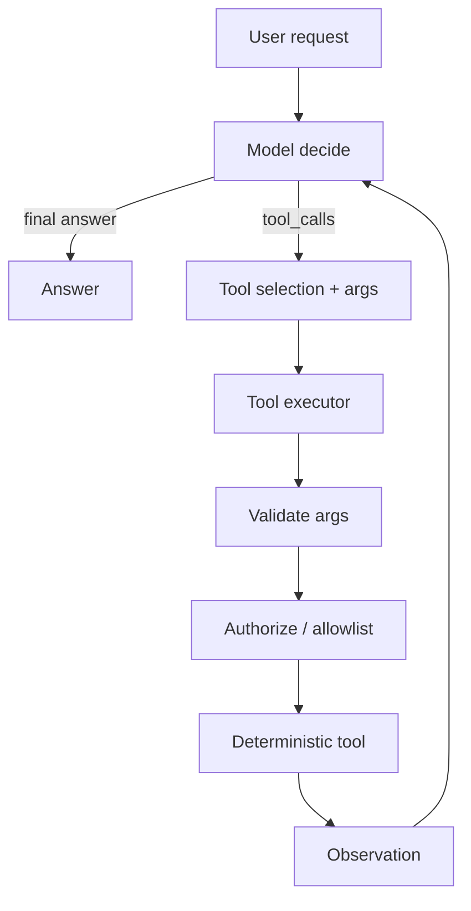
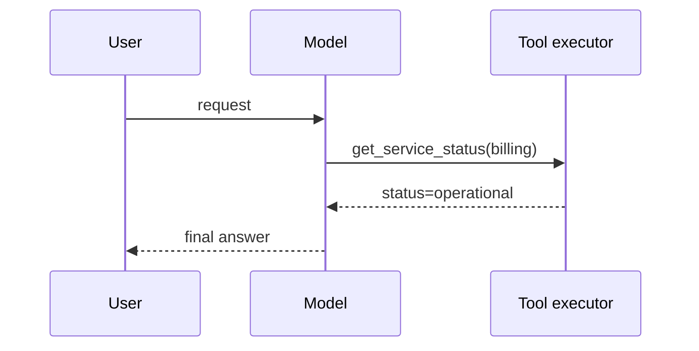
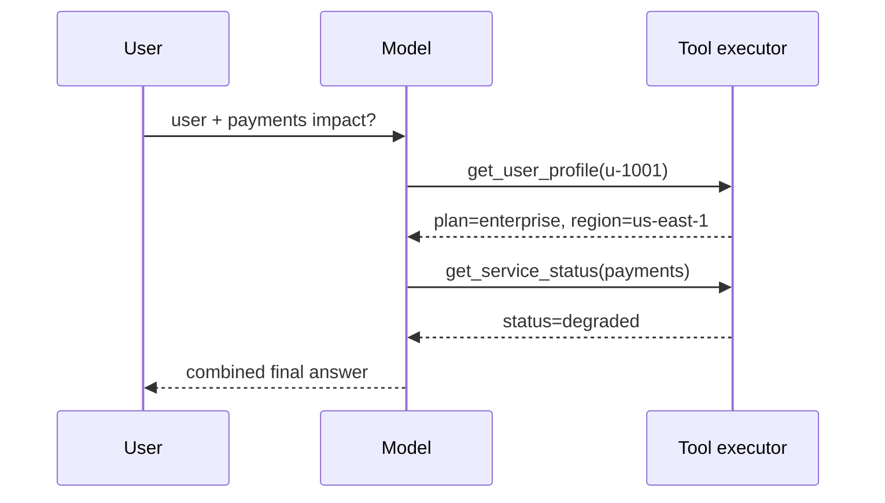

# Tool Calling

**Example ID:** `tool-calling`

## What You Will Build

A minimal, measured **tool-calling loop**: the model decides whether a tool is
needed, selects a tool and arguments, the application executes the tool under
its own policy, the model observes the result, and either continues or answers.

```text
User request
    ↓
Model decides whether a tool is needed
    ↓
Tool selection
    ↓
Tool invocation  (application-enforced)
    ↓
Tool result
    ↓
Model observes result
    ↓
Final answer
```

This is an engineering example of the **fundamental agent/tool interaction
loop**, not a toy chatbot and not a full autonomous agent runtime.

## Tool calling vs agents

**Tool calling is a building block for agents.**

A single tool call (or even a short tool loop) is **not** by itself a
sophisticated autonomous agent. Agents typically add planning over longer
horizons, memory, multi-actor coordination, evaluation loops, and stronger
control policies. This example isolates the observable model ↔ tool contract so
you can see selection, validation, execution, observation, and recovery clearly.

## Architecture



```text
┌────────────┐     decide / tool_calls      ┌─────────────────┐
│   Model    │ ───────────────────────────► │  Application    │
│ (LLM or    │                              │  tool executor  │
│  harness)  │ ◄─────────────────────────── │  + local tools  │
└────────────┘     tool observations         └─────────────────┘
```

### Single-tool sequence



### Multi-step sequence



## How It Works

1. **Tool definitions** — each tool has a name, description, and typed JSON
   schema (`agent/tools.py`).
2. **Model turn** — the model returns either plain content (answer) or
   `tool_calls` (name + arguments). No hidden chain-of-thought is required or
   stored.
3. **Tool selection** — selection is whatever the model (or case harness)
   proposes; the application does not invent calls.
4. **Argument validation** — Pydantic models validate arguments **before**
   handlers run.
5. **Authorization / allowlist** — enforced in `ToolExecutor`, outside the
   model. Model-proposed permissions are never trusted.
6. **Execution** — handlers read local JSON fixtures; no paid tool APIs.
7. **Observation** — structured result or structured error is returned to the
   model as a tool message.
8. **Continue or finish** — the loop repeats until a final answer or
   `max_model_turns`.

## Tools

| Tool | Arguments | Deterministic source |
|------|-----------|----------------------|
| `get_service_status` | `service` | `data/services.json` |
| `get_user_profile` | `user_id` | `data/users.json` |
| `search_documentation` | `query` | `data/docs.json` (keyword score) |

Keep the set small on purpose: the lesson is **selection and execution**, not
building a product surface.

Each successful or failed call records **latency**, **validated arguments**,
and a **structured result/error**.

## Measured cases

| Trace ID | Class | What it shows |
|----------|-------|---------------|
| `direct-answer` | `DIRECT_ANSWER` | User → Model → Answer (no tool) |
| `single-tool-service-status` | `SINGLE_TOOL` | One tool, then answer |
| `multi-step-user-and-payments` | `MULTI_STEP` | Tool A → observe → Tool B → answer |
| `recovery-invalid-service-name` | `ERROR_RECOVERY` | Error → corrected tool call → success |

Cases are driven by a **case harness** so model-turn sequences are reproducible
for Lab traces. **Tool execution is real** through `ToolExecutor` against local
fixtures. Exported traces record that split explicitly:

```text
provenance:
  model:   case-harness   # reproducible model interaction sequence
  tools:   measured       # real ToolExecutor runs
  metrics: measured       # recorded from the run
```

`metricsProvenance: "measured"` remains for Lab convention with other Cookbook
examples. Do **not** read case-harness model turns as a live LLM measurement.
Live LLM mode is available separately via `main.py` when `OPENAI_API_KEY` is set.

### ERROR_RECOVERY

The `ERROR_RECOVERY` case shows:

```text
billing-api → unknown_service → billing → success
```

The failed tool call is preserved. The correction is supplied by the
reproducible case harness — this does **not** claim a live autonomous model
independently discovered the fix.

## Signature teaching view

Exported traces include a `presentation.signatureView` projection:

```text
THINK / DECIDE
      ↓
TOOL CALL          (or skipped, for direct answer)
      ↓
OBSERVATION
      ↓
NEXT ACTION
      ↓
FINAL ANSWER
```

Only **observable** model/tool data is included (content, tool names, arguments,
results, errors, timings). No fabricated chain-of-thought.

## Measured metrics

Recorded execution signals (not benchmarks):

| Metric | Meaning |
|--------|---------|
| `totalMs` | End-to-end loop wall time |
| `modelMs` | Sum of model turn latencies |
| `toolMs` | Sum of tool execution latencies |
| `modelTurns` | Number of model responses |
| `toolCalls` | Number of tool invocations attempted |
| `successfulToolCalls` / `failedToolCalls` | Outcome counts |

Latency depends on environment, provider, and model conditions. Treat it as
**recorded execution**, not a comparative benchmark.

## Run It

Requires Python 3.12+ and [uv](https://docs.astral.sh/uv/).

```bash
cd examples/agents/01-tool-calling
cp .env.example .env
uv sync --extra dev
```

### Measured cases (no paid API)

```bash
uv run python main.py --list-cases
uv run python main.py --case direct-answer --show-sequence
uv run python main.py --case single-tool-service-status --show-sequence
uv run python main.py --case multi-step-user-and-payments --show-sequence
uv run python main.py --case recovery-invalid-service-name --show-sequence
```

### Live model (optional)

```bash
# set OPENAI_API_KEY in .env
uv run python main.py --show-sequence "What is the status of the payments service?"
```

Any OpenAI-compatible endpoint works via `OPENAI_BASE_URL`.

### Export Lab traces

```bash
uv run python export_lab_traces.py
```

Writes `lab_traces.json` with measured sequences suitable for a future
Interactive Lab. **This Cookbook example does not start the Lab.**

## Configuration

| Variable | Default | Purpose |
|----------|---------|---------|
| `OPENAI_API_KEY` | _(optional for cases)_ | Live model key |
| `OPENAI_BASE_URL` | OpenAI default | OpenAI-compatible endpoint |
| `CHAT_MODEL` | `gpt-4o-mini` | Live chat model |
| `MAX_MODEL_TURNS` | `6` | Loop bound |
| `MAX_TOOL_CALLS_PER_TURN` | `4` | Per-turn tool cap |
| `TOOL_TIMEOUT_MS` | `2000` | Tool wall-clock bound |

## Key Code

| Stage | File | Focus |
|-------|------|--------|
| Orchestration | `main.py` | Cases + live entrypoint |
| Loop | `agent/loop.py` | Decide → call → observe → answer |
| Tools | `agent/tools.py` | Schemas + deterministic handlers |
| Executor | `agent/executor.py` | Validate, allowlist, authorize, time |
| Model clients | `agent/model.py` | Live OpenAI + case harness |
| Cases | `agent/cases.py` | Measured teaching scenarios |
| Trace export | `agent/trace.py`, `export_lab_traces.py` | Lab-ready traces |

## Engineering safety

Practical controls shown in this example:

| Concern | Approach here |
|---------|----------------|
| **Validate tool arguments** | Pydantic arg models before handlers |
| **Authorization outside the model** | `ToolExecutor` role checks |
| **Never trust model-generated permissions** | Allowlist + roles are application-owned |
| **Tool allowlists** | Executor rejects non-allowlisted names |
| **Structured tool schemas** | JSON Schema parameters on each tool |
| **Timeouts** | `TOOL_TIMEOUT_MS` checked after execution |
| **Bounded retries** | Loop capped by `MAX_MODEL_TURNS`; no unbounded auto-retry storm |
| **Logging / observability** | Sequence events + metrics on every run |
| **Prompt injection at tool boundaries** | Tool results are data, not new system instructions; keep handlers narrow and deterministic |

### Timeouts

Local handlers are fast; the timeout field still encodes the production pattern:
the **application** owns the deadline, not the model.

### Retries

Recovery in the measured case is **model-visible**: the model sees an error
observation and issues a corrected call. The application does not silently
retry with different arguments on the model's behalf.

### Observability

Every run produces an ordered `sequence` of observable events (`user_request`,
`model_turn`, `tool_call`, `observation`, `final_answer`, `error`). That sequence
is what a Lab can visualize.

### Latency and cost

- More model turns ⇒ more latency and token cost.
- Parallel tool fan-out can reduce wall time but increases blast radius if
  validation is weak — this example executes tools sequentially for clarity.
- Deterministic local tools keep **tool cost at zero**; live LLM cost is
  separate.

### Production considerations

- Keep tool surfaces small and typed.
- Enforce authz in the executor / gateway, not in prompts.
- Treat tool outputs as untrusted data when feeding them back into prompts.
- Cap turns, tool calls per turn, and payload sizes.
- Prefer idempotent tools or explicit side-effect gates for mutating tools
  (this demo only has read-only tools).
- Record provenance (`measured`, model driver, tool versions/fixtures).

## Limitations

- Case-harness traces demonstrate the **loop contract** reproducibly; live model
  selections may differ for the same prompt.
- Tools are read-only fixtures — no real infrastructure mutations.
- Authorization is a demo role check, not a full IAM system.
- No streaming, no multi-agent planning, no long-term memory.
- Timeout is post-check on fast local tools (pattern, not a preemptive cancel).

## Tests

```bash
uv run pytest -q
uv run ruff check .
uv run ruff format --check .
```

Tests use the case harness and local tools only — **no paid APIs**, no model
downloads, no external services.

## Where it fits

```text
AI AGENTS
01 Tool Calling   ← you are here
```

Next agent examples will build on this loop; they are not included until
implemented.
