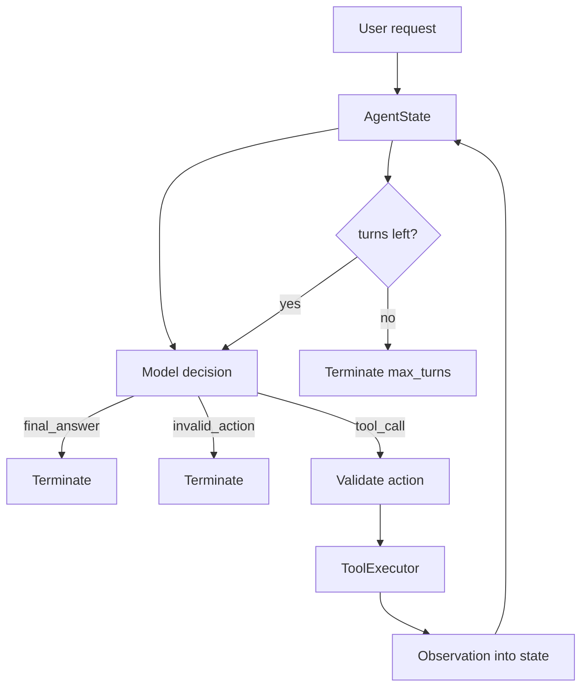

# Agent Loop

**Example ID:** `agent-loop`

## What You Will Build

A small, measured **agent loop runtime**: the application maintains state across
iterations, asks the model for the next observable action, validates and executes
tools under application policy, feeds observations back into state, and terminates
when the task is complete or a safety boundary is reached.

```text
User Request
    ↓
AgentState
    ↓
Model Decision
    ↓
Validate Action
    ↓
Execute Tool
    ↓
Observation
    ↓
Update AgentState
    ↓
Next Model Decision
    ↓
...
    ↓
Termination
```

> The model proposes the next action. The application owns state, execution, and
> termination.

This is a teaching example of the **runtime loop**, not a generic autonomous
agent demo and not a production multi-agent system.

## Tool Calling vs Agent Loop

**Tool calling** answers:

> How does a model request and use a tool?

**Agent loop** answers:

> How does an application repeatedly let the model act based on the results of
> previous actions?

```text
Tool Calling

Model → Tool → Observation → Answer
```

versus:

```text
Agent Loop

Model → Tool → Observation
          ↑
          │
       next decision
          │
          └──────── Model → ...
```

The [Tool Calling](../01-tool-calling) example teaches selection, execution,
observation, the executor security boundary, and basic multi-step tool use.

This example focuses on:

- persistent loop state (`AgentState`)
- repeated model → action → observation cycles
- iteration and turn counting
- explicit termination
- `max_turns` safety boundary
- invalid-action rejection
- observability of the full loop

| Concern | Tool Calling (01) | Agent Loop (02) |
|---------|-------------------|-----------------|
| Primary lesson | model ↔ tool contract | application-owned runtime |
| State | messages inside the loop | explicit serializable `AgentState` |
| Termination | answer or turn cap | `final_answer` / `max_turns` / `invalid_action` / `error` |
| Teaching cases | direct, single, multi, recovery | simple loop, termination, max turns, invalid action |

## Architecture



```text
┌────────────┐   propose next action    ┌──────────────────────┐
│   Model    │ ───────────────────────► │  Application runtime │
│ (LLM or    │                          │  • AgentState        │
│  harness)  │ ◄─────────────────────── │  • turn limits       │
└────────────┘   observations / stop    │  • ToolExecutor      │
                                        │  • termination       │
                                        └──────────────────────┘
```

The model does not control the runtime. Turn limits, action validation, tool
allowlists, and termination are application policy.

### Simple multi-iteration sequence

```mermaid
sequenceDiagram
    participant User
    participant Runtime as Agent loop
    participant Model
    participant Tool as ToolExecutor
    User->>Runtime: check payments; if degraded, read docs
    Runtime->>Model: decide (turn 1)
    Model-->>Runtime: get_service_status(payments)
    Runtime->>Tool: execute
    Tool-->>Runtime: degraded + PAY-2041
    Runtime->>Model: decide (turn 2, with observation)
    Model-->>Runtime: search_documentation(...)
    Runtime->>Tool: execute
    Tool-->>Runtime: payments runbook
    Runtime->>Model: decide (turn 3)
    Model-->>Runtime: final answer
    Runtime-->>User: terminate(final_answer)
```

## Runtime state

`agent/state.py` exposes an explicit, serializable `AgentState`:

| Field | Meaning |
|-------|---------|
| `request` | Original user request |
| `current_turn` | Turns consumed so far |
| `max_turns` | Hard application limit |
| `decisions` | Observable model decisions |
| `tool_calls` / `observations` | Recorded actions and results |
| `final_answer` | Answer when complete |
| `termination_reason` | Why the loop stopped |

The application owns `AgentState` across iterations. Each observation is appended
to state before the next model decision.

## Execution loop

Conceptually:

```text
while not terminated:
    if current_turn >= max_turns:
        terminate(max_turns)
        break

    begin_turn()
    model decides next observable action

    if final_answer:
        terminate(final_answer)
    elif tool_call:
        validate + execute via ToolExecutor
        append observation to state
        continue
    else:
        terminate(invalid_action)
```

The **application** owns the loop. The model proposes; it does not enforce
permissions, timeouts, or turn limits.

## Termination contract

The runtime stops with an explicit `termination_reason`. Supported values in
measured traces:

| Reason | When |
|--------|------|
| `final_answer` | Model produces an answer with no tool calls |
| `max_turns` | Turn budget exhausted without a final answer |
| `invalid_action` | Model emits an unrecognized action kind |
| `error` | Reserved for hard runtime failures (not used in measured cases) |

### `final_answer`

The model/runtime reaches a final answer and the loop completes normally.

### `max_turns`

The runtime reaches the configured hard turn limit and stops execution.

> `max_turns` is an application safety boundary, not a model decision.

Example with `max_turns=3`:

```text
Turn 1 → tool call
Turn 2 → tool call
Turn 3 → tool call
Turn limit reached → stop
```

The measured `MAX_TURNS` case uses a harness that keeps requesting another tool
action. The runtime stops at the limit even though the harness would continue
proposing actions. That is intentional: loop boundaries are application policy,
not model courtesy.

### `invalid_action`

The runtime receives an unsupported action and rejects it rather than executing it.

> Action validation belongs to the application boundary.

The model may propose an action, but the runtime decides whether that action is
valid.

## ToolExecutor boundary

Unchanged in role from tool calling:

- schema validation
- allowlists
- authorization
- timeouts
- structured observations

The model may propose a tool and arguments. The application decides what runs.

## Deterministic case harness

Measured Cookbook traces use a **case harness** (`provenance.model=case-harness`).
Tool execution is real against local fixtures (`provenance.tools=measured`).
Metrics are recorded from the run (`provenance.metrics=measured`).

> The case harness makes model decisions reproducible for teaching. Tool execution
> and recorded metrics remain measured.

This is **not** a benchmark. Harness turns do not represent live production model
latency or quality.

## No chain-of-thought

> The Cookbook records observable decisions and execution events only. It does
> not store or expose hidden chain-of-thought.

Traces contain model decisions, tool calls, observations, and termination — not
internal reasoning text.

## Measured cases

| Trace ID | Class | Teaches |
|----------|-------|---------|
| `simple-loop-payments-docs` | `SIMPLE_LOOP` | status → docs → answer across iterations |
| `termination-after-status` | `TERMINATION` | stop as soon as the task is complete |
| `max-turns-safety-boundary` | `MAX_TURNS` | hard turn limit stops runaway loops |
| `invalid-action-rejected` | `INVALID_ACTION` | runtime rejects unrecognized actions |

## Measured metrics

Recorded execution only (local latency may round to 0ms):

- `totalMs`, `modelMs`, `toolMs`
- `modelTurns`, `toolCalls`, `successfulToolCalls`, `failedToolCalls`
- `terminationReason`, `maxTurns`
- `provenance: measured`

## Run It

```bash
cd examples/agents/02-agent-loop
uv sync --extra dev

# Measured cases (no paid API)
uv run python main.py --list-cases
uv run python main.py --case simple-loop-payments-docs --show-sequence
uv run python main.py --case max-turns-safety-boundary --show-sequence

# Export Lab traces
uv run python export_lab_traces.py

# Tests
uv run pytest -q
```

Optional live mode (requires `OPENAI_API_KEY` in `.env`):

```bash
cp .env.example .env
uv run python main.py "Check the payments service..."
```

Live mode is separate from measured Cookbook traces.

## Configuration

| Setting | Default | Role |
|---------|---------|------|
| `MAX_TURNS` | `6` | Hard loop boundary |
| `MAX_TOOL_CALLS_PER_TURN` | `4` | Per-turn tool cap |
| `TOOL_TIMEOUT_MS` | `2000` | Executor wall-clock bound |
| `CHAT_MODEL` | `gpt-4o-mini` | Live mode only |

## Key code

| File | Role |
|------|------|
| `agent/state.py` | Explicit serializable loop state |
| `agent/loop.py` | Runtime: decide → act → observe → terminate |
| `agent/executor.py` | Validate / authorize / execute tools |
| `agent/cases.py` | Deterministic measured cases |
| `agent/trace.py` | Lab traces + teaching presentation metadata |
| `export_lab_traces.py` | Write `lab_traces.json` |

## Engineering safety / limitations

- Local fixtures only for measured runs — no paid tool APIs
- No hidden reasoning stored or displayed
- Not a planner, memory system, evaluator, or multi-agent orchestrator
- Case harness turns are reproducible teaching fixtures, not live model scores
- Turn limits and allowlists are demo-scale; production policies are stricter

This lab remains focused on:

**State → Decision → Action → Observation → Next Decision → Termination**

## Tests

```bash
uv run pytest -q
uv run ruff check .
```

## Where it fits

```text
AI AGENTS
  01 Tool Calling
  02 Agent Loop  ← you are here
```
