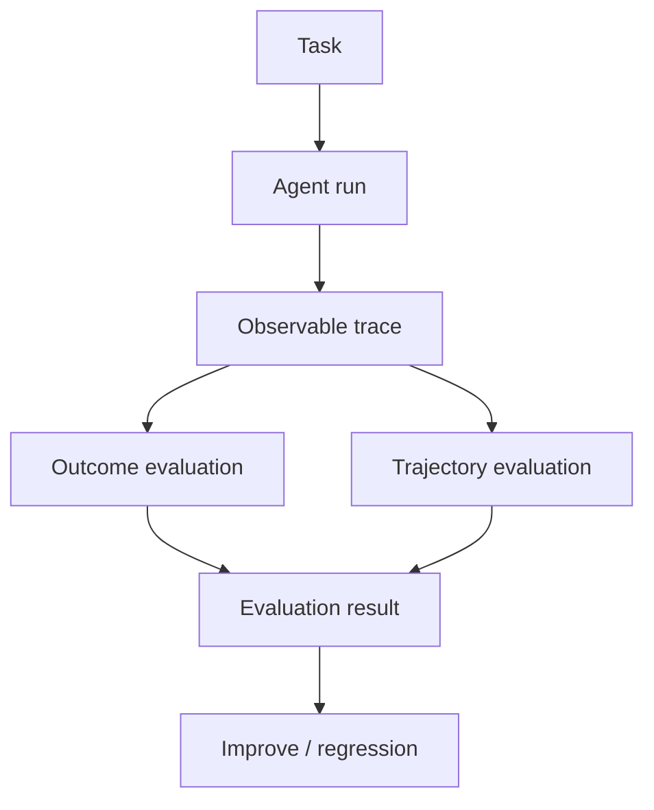

# Agent Evaluation

**Example ID:** `agent-evaluation`

## What You Will Build

A small, measured **agent evaluation** example: a support/investigation agent
runs against deterministic local fixtures, records an observable execution
trace, and is scored against explicit case criteria.

```text
Task
  ↓
Agent Run
  ↓
Trace
  ↓
Outcome Evaluation
  +
Trajectory Evaluation
  ↓
Evaluation Result
  ↓
Improve / Regression
```

This example teaches **RUN → TRACE → EVALUATE**. The broader engineering loop
is:

```text
BUILD → RUN → TRACE → EVALUATE → IMPROVE
```

> Agent evaluation evaluates **outcome + trajectory under constraints**.

This is a teaching example, not a general-purpose evaluation framework and not
a benchmark of agent systems.

## What agent evaluation is

**Tool calling** answers: how does a model request and use a tool?

**Agent loop** answers: how does an application repeatedly let the model act?

**Agent evaluation** answers:

> Did this agent run complete the task, and did its trajectory satisfy the
> constraints we care about?

A complete evaluation looks at more than the last string the model emitted.
It inspects:

- whether the assigned task succeeded
- whether the final answer is correct
- which tools were selected, with which arguments
- whether tool execution and result interpretation worked
- whether the trajectory stayed within explicit constraints
- whether failures were recovered
- operational cost of the run (latency, turns, tool calls)

Those are related questions. They are not the same question.

## Why final-answer correctness is not enough

Task success and final-answer correctness are **related but distinct**.

| Check | Asks |
|-------|------|
| Final-answer correctness | Does the answer contain the required observable facts? |
| Task success | Did the agent complete the assigned task under the case criteria? |

An answer can mention the right facts without the agent having gathered the
required evidence (for example, by guessing). That can pass final-answer
correctness and still fail task success.

An agent can also gather the right evidence, terminate normally with a final
answer, and still fail evaluation because the answer does not satisfy the
task. Final-answer *presence* is not task success.

## Outcome vs trajectory evaluation

```text
Outcome evaluation     Trajectory evaluation (hard constraints)
─────────────────      ────────────────────────────────────────
task success           tool selection
final-answer           tool arguments
correctness            tool execution
                       step efficiency
                       error recovery

Reported separately:   result interpretation
```

Trajectory success is constraint satisfaction, not a unique gold path.

Not every evaluated dimension is necessarily a hard trajectory constraint.
This example reports result interpretation separately; trajectory success
reflects the constraints designated by the case rubric.

Two teaching contrasts are intentional:

| Case | Outcome | Trajectory | Lesson |
|------|---------|------------|--------|
| `PARTIAL_SUCCESS` | succeeds | fails efficiency | Correct outcome does not necessarily mean a good trajectory |
| `GOAL_MISS` | fails | satisfies path constraints | A normal termination can still fail evaluation |

## Tool-call evaluation dimensions

Tool-call evaluation in this example distinguishes:

| Dimension | What it checks |
|-----------|----------------|
| Tool selection | Were the required tools used? Extra tools do not fail this check. |
| Argument correctness | Did at least one successful call satisfy the required arguments? |
| Execution result | Did each required tool produce at least one successful observation? |
| Result interpretation | Does the final answer reflect the payments status observation? Reported separately; not a hard trajectory constraint. |
| Recovery | If a tool failed, was it followed by a successful retry of the same tool? |

These checks are case-level and explainable. They are not a universal scoring
standard.

## Operational metrics vs quality metrics

Operational metrics describe the cost of the run. Quality evaluation describes
whether the run was good under the rubric.

| Operational (measured) | Quality (computed) |
|------------------------|--------------------|
| `totalMs`, `modelMs`, `toolMs` | `taskSuccess` |
| `modelTurns` | `finalAnswerCorrect` |
| `toolCalls` | `trajectorySuccess` |
| `successfulToolCalls` | tool-call dimensions |
| `failedToolCalls` | `stepEfficiency` (case constraint) |
| | `recovery` |

This example does **not** mix operational metrics into quality scoring.

It also does **not** invent a composite "agent score". A single number would
hide the outcome/trajectory split that the example exists to teach.

## The four cases

All four cases use the same support task against local fixtures:

> Check the payments service. If it is degraded, inspect the relevant
> documentation and summarize what the user should know.

Payments is degraded (`PAY-2041`). Useful work is: check status, read the
payments runbook, summarize user impact.

| Trace ID | Class | Teaches |
|----------|-------|---------|
| `task-success-payments-docs` | `TASK_SUCCESS` | Correct tools, arguments, observations, answer, and trajectory |
| `partial-success-extra-profile` | `PARTIAL_SUCCESS` | Correct answer after an unnecessary `get_user_profile` call |
| `tool-error-recovery-payments` | `TOOL_ERROR_RECOVERY` | Failed `payments-api` lookup, recovered canonical call, then docs |
| `goal-miss-wrong-answer` | `GOAL_MISS` | Required evidence gathered; final answer still fails the task |

### Case constraints

Trajectory success uses explicit constraints, not a unique gold path.

For the success / partial / goal-miss rubric:

- required tools: `get_service_status`, `search_documentation`
- required arguments: `service=payments`; documentation query contains `payment`
- required answer facts: `degraded`, `PAY-2041`, `checkout`
- expected maximum useful tool calls: **2**

The recovery case uses the same outcome facts, expects a recoverable tool
failure, and sets the useful-tool-call maximum to **3** so the retry is not
scored as inefficiency.

`PARTIAL_SUCCESS` reports the efficiency violation clearly:

> Observed 3 tool call(s), which exceeds the case constraint of at most 2
> useful tool call(s).

That limit is a **case constraint**, not a universal efficiency formula.

### Recovery accounting

For the recovery case:

- the failed tool call and error observation remain in the trace
- `recovery.attempted` and `recovery.succeeded` are recorded
- `errorRecoveryRate` is recovered failures / failures for **this case**
- the recovered failure is not counted as overall task failure

A ratio of `1/1` on one teaching case is not a statistically meaningful
production estimate.

## How traces are generated

Measured Cookbook traces use a **case harness** (`provenance.model=case-harness`).
Tool execution is real against local fixtures (`provenance.tools=measured`).
Metrics are recorded from the run (`provenance.metrics=measured`).

```text
Case harness  →  observable model decisions
ToolExecutor  →  real tool results from data/*.json
Runtime       →  sequence + operational metrics
Evaluator     →  computed evaluation (does not rewrite the run)
```

The case harness makes model decisions reproducible for teaching. Tool
execution and recorded metrics remain measured.

Live model execution is an optional CLI mode. It is **not** the source of
committed Lab traces, and tests do not require an API key.

## How evaluation criteria are defined

Each measured case carries an explicit rubric (`evaluation/criteria.py`):

- required tools
- required arguments / argument substrings
- required final-answer facts
- maximum useful tool calls, when the case teaches efficiency
- whether recovery is expected

Gold / expected behavior is **observable only**:

- expected tool
- expected arguments
- expected result condition
- expected final-answer facts
- maximum allowed useful tool calls
- whether recovery is expected

The example never stores chain-of-thought, hidden reasoning, or private
deliberation.

A trajectory may take extra successful steps and still fail only the
constraint those extra steps violate. It does not have to match one unique
path.

## Offline evaluation using deterministic cases

Evaluation does **not** require every evaluation to use a production trace.

These four cases are **offline evaluation fixtures**: deterministic local
tools, a scripted model harness, and an explicit rubric. That is enough to
teach RUN → TRACE → EVALUATE and to keep CI reproducible.

A production system can later add sampled online traces. This example does
not pretend the four cases are that production sample.

## How this could become regression evaluation in CI

The same measured cases already run in pytest with no API key:

- task success stays classified correctly
- the inefficient extra tool call is detected
- the recovered failure remains in the trace and is classified as recovered
- the goal-miss case remains a failure
- evaluation results stay stable

That is the seed of **regression evaluation**: freeze the fixtures and rubric,
then fail CI when an implementation change alters outcome or trajectory
classification. It is a control mechanism for this teaching workload, not a
claim that four cases protect a production agent.

## Why this is not a benchmark

- Four deterministic cases
- One local fixture set
- A scripted case harness, not a live model leaderboard
- Case-specific constraints, not industry-standard thresholds
- No composite agent quality score
- No claim about other agents, vendors, or production traffic

Do not read these results as a ranking of agent systems.

## Provenance

| Field | Value | Meaning |
|-------|-------|---------|
| `provenance.model` | `case-harness` | Model turns are predetermined teaching fixtures |
| `provenance.tools` | `measured` | ToolExecutor ran against local JSON fixtures |
| `provenance.metrics` | `measured` | Latency and counts come from the run |
| `evaluationProvenance` | `computed` | Rubric applied after the run; not a live judge |

Measured execution fields stay separate from teaching/presentation metadata.

The evaluator does **not** modify the measured sequence, metrics, or answer.
Evaluation is attached as a sibling of the trace.

## LLM-as-a-judge is an evaluator, not ground truth

This example uses a **deterministic rubric**, not an LLM judge.

If an LLM were used as a judge, it would still be an **evaluator**: another
model applying a rubric, with its own errors and biases. It would not become
ground truth. Human review, frozen fixtures, and explicit constraints remain
the authority for these teaching cases.

## No chain-of-thought

> The Cookbook records observable decisions and execution events only. It does
> not store or expose hidden chain-of-thought.

Traces contain model decisions, tool calls, observations, final answers,
termination, and computed evaluation — not internal reasoning text.

## Architecture



```text
┌────────────┐  propose next action   ┌──────────────────────┐
│   Model    │ ─────────────────────► │  Application runtime │
│ (harness)  │                        │  • loop + tools      │
└────────────┘                        └──────────┬───────────┘
                                                 │ measured trace
                                                 ▼
                                      ┌──────────────────────┐
                                      │  Evaluator           │
                                      │  • explicit criteria │
                                      │  • computed result   │
                                      └──────────────────────┘
```

The runtime owns execution. The evaluator owns scoring. Neither is the other.

## Measured metrics

Recorded execution only (local latency may round to 0ms):

- `totalMs`, `modelMs`, `toolMs`
- `modelTurns`, `toolCalls`, `successfulToolCalls`, `failedToolCalls`
- `terminationReason`, `maxTurns`
- `provenance: measured`

Computed evaluation (not mixed into the metrics object):

- `taskSuccess`, `finalAnswerCorrect`, `trajectorySuccess`
- tool selection / arguments / execution / interpretation
- `stepEfficiency` against the case constraint
- `recovery` including `errorRecoveryRate` when failures occurred

## Run It

```bash
cd examples/agents/03-agent-evaluation
uv sync --extra dev

# Measured cases (no paid API)
uv run python main.py --list-cases
uv run python main.py --case task-success-payments-docs --show-sequence
uv run python main.py --case partial-success-extra-profile --show-sequence
uv run python main.py --case tool-error-recovery-payments --show-sequence
uv run python main.py --case goal-miss-wrong-answer --show-sequence

# Export Lab traces
uv run python export_lab_traces.py

# Tests
uv run pytest -q
```

Optional live mode (requires `OPENAI_API_KEY` in `.env`):

```bash
cp .env.example .env
uv run python main.py "Check the payments service..."
```

Live mode is separate from measured Cookbook traces. Committed traces and
tests do not use it.

## Configuration

| Setting | Default | Role |
|---------|---------|------|
| `MAX_TURNS` | `6` | Hard loop boundary |
| `MAX_TOOL_CALLS_PER_TURN` | `4` | Per-turn tool cap |
| `TOOL_TIMEOUT_MS` | `2000` | Executor wall-clock bound |
| `CHAT_MODEL` | `gpt-4o-mini` | Live mode only |

## Key code

| File | Role |
|------|------|
| `agent/loop.py` | Runtime: decide → act → observe → terminate |
| `agent/cases.py` | Four deterministic measured cases |
| `evaluation/criteria.py` | Explicit observable case constraints |
| `evaluation/evaluator.py` | Deterministic outcome + trajectory scoring |
| `agent/trace.py` | Lab traces + teaching presentation metadata |
| `export_lab_traces.py` | Write `lab_traces.json` |

## Engineering safety / limitations

- Local fixtures only for measured runs — no paid tool APIs
- No hidden reasoning stored or displayed
- Not a planner, memory system, multi-agent orchestrator, or eval platform
- Not a benchmark; four cases cannot represent production traffic
- Step efficiency is a case constraint, not a standard metric
- Recovery rate on one case is not a production reliability estimate
- LLM-as-a-judge is not used and would not be ground truth if it were
- Offline fixtures are sufficient; not every evaluation needs a production trace
- Online evaluation, when added later, should sample production runs rather
  than requiring every request
- Human-in-the-loop escalation is out of scope here; if added, intended HITL
  should be distinguished from unexpected escalation
- Safety applies to the agent run and trajectory, not merely the final answer
- Multi-agent evaluation would add dimensions; it would not replace task success
- Case harness turns are reproducible teaching fixtures, not live model scores

This lab remains focused on:

**Run → Trace → Evaluate outcome and trajectory under explicit constraints**

## Tests

```bash
uv run pytest -q
uv run ruff check .
```

## Where it fits

```text
AI AGENTS
  01 Tool Calling
  02 Agent Loop
  03 Agent Evaluation  ← you are here
```
