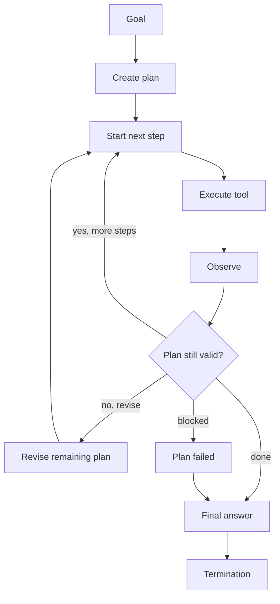

# Agent Planning

**Example ID:** `agent-planning`

## What You Will Build

A small, measured **planning runtime**: the application creates an explicit
multi-step plan, executes that plan, tracks step progress, and revises the
remaining plan when an observation invalidates it.

```text
Goal
  ↓
Plan
  ↓
Execute
  ↓
Observe
  ↓
Continue / Revise
  ↓
Final Answer
```

> Agent Loop repeatedly selects the next action. Planning introduces an
> explicit multi-step plan that the application can track, execute, and
> revise.

This is an explanatory example of **plan state as a runtime artifact**, not a
claim that planning is universally better than a reactive loop, and not a
production planner.

## What agent planning means

The plan is an execution artifact, not merely a numbered list generated
by the model. It is an application-owned execution object with:

- an id and version
- ordered steps
- per-step status (`pending`, `in_progress`, `completed`, `skipped`, `failed`)
- a plan status (`pending`, `in_progress`, `completed`, `failed`, `superseded`)

The model/case harness may **propose** a plan, a revision, or a final answer.
The application **validates** structure, allowed tools, state transitions,
execution, and termination.

## Planning vs Agent Loop

**Agent Loop** answers:

> How does an application repeatedly let the model choose the next action?

**Planning** answers:

> How does an application create a multi-step plan, execute it, track
> progress, and revise remaining steps when observations change what is
> appropriate?

Agent Loop repeatedly selects the next action. Planning introduces an
explicit multi-step plan that the application can track, execute, and
revise.

```text
Agent Loop

Model → next action → Observation
          ↑
          └──────── Model → next action → ...
```

versus:

```text
Planning

Model proposes plan
          ↓
Runtime executes step 1 → Observation
          ↓
Plan still valid?
  ├── yes → execute next planned step
  └── no  → model proposes revised remaining plan
                ↓
           runtime executes revised step
```

The [Agent Loop](../02-agent-loop) example covers repeated next-action
selection under application-owned state and termination.

This example focuses on:

- explicit plan state
- step progress
- plan versioning
- observation-triggered revision
- honest plan failure

Planning is not a replacement for a loop in every system. A reactive loop is
often enough. Use an explicit plan when the intended sequence must be
visible, tracked, and revisable.

| Concern | Agent Loop (02) | Planning (04) |
|---------|-----------------|---------------|
| Primary lesson | next action is selected repeatedly | a plan exists as a runtime artifact |
| Model role | propose the next tool or answer | propose a plan, a revision, or an answer |
| Execution | one decided action per model turn | runtime walks validated plan steps |
| Progress | turn / observation lists | step status against the plan |
| Change of course | the next decision differs | remaining plan is revised to a new version |
| Failure | invalid action / max turns / error | incomplete plan is `failed`, not `completed` |

## Why explicit plan state matters

If the only “plan” is text from the model, the application cannot:

- know which step is active
- prevent re-execution of completed steps
- preserve the original plan after a change
- stop honestly when a prerequisite is missing

Explicit plan state makes those facts observable.

## Plan creation

The first model turn proposes an ordered list of steps. Each tool step names
an allowlisted tool and arguments. The last step may be `finalize`.

The application:

- rejects unknown tools and invalid arguments
- ignores any status the harness tries to set
- stores the plan as version 1 with every step `pending`

> The model proposes. The application installs the plan.

## Plan execution

The runtime executes the next pending tool step through `ToolExecutor`. That
is not a new model decision. Tool execution is plan execution.

```text
PLAN v1
  step-1  in_progress  → tool → observation → completed
  step-2  pending
  step-3  pending
```

Completed steps are not executed again.

## Plan progress

Each `plan_step_started` / `plan_step_completed` event records:

- the active step
- completed / in_progress / pending / skipped / failed ids
- remaining steps

A plan is useful only when execution state can be tracked against it.

## Plan revision

Revision is triggered by an **observable condition**, not at random.

In this example: if a status-check observation shows a service is
`operational` and remaining steps still have intent `remediation`, the
remaining plan is no longer appropriate.

```text
PLAN v1
  ↓
Observation
  ↓
Remaining plan no longer appropriate
  ↓
PLAN v2
  ↓
Continue execution
```

The original plan is **not overwritten**. The runtime preserves plan v1 and
installs plan v2, which **supersedes** v1. Completed steps stay completed.
Remaining steps on v1 are skipped on the frozen snapshot. New remaining
steps are added on v2.

```text
PLAN v1                    PLAN v2
1. Check payments ✓        1. Check payments ✓
2. Remediation docs        2. Recent deployment
3. Recommend remediation   3. Summarize current status
```

> Planning is adaptive. A plan is not a fixed script.

## Plan failure

If a required prerequisite cannot be satisfied — here, the AUTH-881 incident
runbook is not in the documentation fixtures — the runtime:

- marks the blocking step `failed`
- skips remaining steps
- sets plan status to `failed`
- terminates with `plan_failed`
- records a final answer that reports the limitation

The plan is not marked `completed`. The final answer does not claim success.

`plan_failed` is a runtime/application state. The model/harness may still
produce a final answer that reports the limitation; the application
decides that the plan did not complete.

> A plan that cannot complete must terminate honestly rather than being
> reported as successful.

## Application-owned plan state

| Owned by the application | May be proposed by the model/harness |
|--------------------------|--------------------------------------|
| plan id / version        | step descriptions                    |
| step status              | tool names and arguments             |
| plan status              | revised remaining steps              |
| validity / revision      | final answer text                    |
| tool execution           |                                      |
| termination              |                                      |

A model-proposed plan never bypasses validation, allowlists, or executor
policy.

## Observable traces

Traces contain observable decisions and execution events only:

`user_request` → `plan_created` → `plan_step_started` → `tool_call` →
`observation` → `plan_step_completed` → (`plan_revised`) → `final_answer` →
`termination`

The future Interactive Lab can reconstruct original vs revised plans, step
state, the invalidating observation, and why execution stopped.

## Provenance

Measured Cookbook traces use a **case harness** (`provenance.model=case-harness`).
Tool execution is real against local fixtures (`provenance.tools=measured`).
Metrics are recorded from the run (`provenance.metrics=measured`).

> The case harness makes planning decisions reproducible for this example.
> Tool execution and recorded metrics remain measured.

Live model execution is an optional CLI mode. It is not the source of
committed Lab traces.

## No chain-of-thought

> The Cookbook records observable decisions and execution events only. It does
> not store or expose hidden chain-of-thought.

Traces contain plan proposals, step state, tool calls, observations,
revisions, answers, and termination — not internal reasoning text.

## Operational metrics

Recorded execution only (local latency may round to 0ms):

- `totalMs`, `modelMs`, `toolMs`
- `modelTurns`, `toolCalls`, `successfulToolCalls`, `failedToolCalls`
- `planSteps`, `completedSteps`, `skippedSteps`, `failedSteps`
- `planRevisions`, `planVersion`, `planStatus`
- `terminationReason`, `maxTurns`
- `provenance: measured`

These fields describe what happened. They are not a plan-quality score.
Fewer steps is not automatically a better plan.

## Measured cases

The scenario is a small support investigation against local fixtures.

Payments is **operational**. Auth is in **major_outage** (`AUTH-881`). The
AUTH-881 incident runbook is **not** in the documentation set.

| Trace ID | Class | Demonstrates |
|----------|-------|---------|
| `simple-plan-billing-docs` | `SIMPLE_PLAN` | Successful multi-step plan: create, execute, complete, zero revisions |
| `plan-execution-payments-progress` | `PLAN_EXECUTION` | Step-by-step progress: pending → in_progress → completed / remaining |
| `plan-revision-payments-healthy` | `PLAN_REVISION` | Observation (payments healthy) invalidates remaining remediation steps; v2 supersedes v1 |
| `plan-failure-auth-runbook-missing` | `PLAN_FAILURE` | Required documentation is unavailable; plan fails and terminates honestly |

### SIMPLE_PLAN

Planning makes the intended sequence of work explicit before execution.

Expected: plan created, all steps completed, `planRevisions=0`,
`planStatus=completed`, `termination=final_answer`.

### PLAN_EXECUTION

A plan is useful only when execution state can be tracked against it.

Agent Loop repeatedly asks the model to decide what action to take next.
In this measured case, the runtime executes multiple planned steps
without asking the model to select a new data tool for every step.

The recorded run uses 2 model turns for 3 planned tool executions. That
count is a property of this case: not a planning benchmark, not a
universal efficiency claim, and not the definition of Planning.

This case uses more steps than SIMPLE_PLAN so remaining work is visible
after each completion (`pending` → `in_progress` → `completed`).

### PLAN_REVISION

Planning is adaptive. A plan is not a fixed script.

Initial plan: check payments → inspect remediation docs → recommend
remediation. Observation: payments is operational. Remaining remediation
steps are no longer appropriate. Revised plan: check recent deployment
information → summarize current status. Execution then continues on v2.

The runtime preserves the original plan and creates a revised plan. It
does not silently replace v1. The trace keeps **both** versions.

### PLAN_FAILURE

A plan that cannot complete must terminate honestly rather than being
reported as successful.

Plan: check auth → find AUTH-881 runbook → recommend remediation. The
required document is missing. Remaining work cannot be completed. The
application sets `planStatus=failed` and terminates with `plan_failed`.
That is a runtime/application state, not a model decision.

## Architecture



```text
┌────────────┐  propose plan / revision / answer  ┌──────────────────────┐
│   Model    │ ─────────────────────────────────► │  Application runtime │
│ (harness)  │                                    │  • Plan + versions   │
└────────────┘                                    │  • step status       │
       ▲                                          │  • ToolExecutor      │
       └──────── observations / stop ──────────── │  • termination       │
                                                  └──────────────────────┘
```

Data tools are not selected turn-by-turn. They run only as validated plan
steps.

## Termination contract

| Reason | When |
|--------|------|
| `final_answer` | Plan completed and a final answer was recorded |
| `plan_failed` | Remaining plan cannot be completed; application marks the plan failed |
| `max_turns` | Turn budget exhausted (safety boundary) |
| `invalid_action` | Unrecognized action or invalid plan proposal |
| `error` | Reserved for hard runtime failures (not used in measured cases) |

`plan_failed` is an application/runtime state. A failed plan is never
represented as successful completion.

## ToolExecutor boundary

Unchanged in role from previous Agent examples:

- schema validation
- allowlists
- authorization
- timeouts
- structured observations

Plan steps may name a tool and arguments. The application decides what runs.

## Run It

```bash
cd examples/agents/04-planning
uv sync --extra dev

# Measured cases (no paid API)
uv run python main.py --list-cases
uv run python main.py --case simple-plan-billing-docs --show-sequence
uv run python main.py --case plan-execution-payments-progress --show-sequence
uv run python main.py --case plan-revision-payments-healthy --show-sequence
uv run python main.py --case plan-failure-auth-runbook-missing --show-sequence

# Export Lab traces
uv run python export_lab_traces.py

# Tests
uv run pytest -q
```

Optional live mode (requires `OPENAI_API_KEY` in `.env`):

```bash
cp .env.example .env
uv run python main.py "Investigate the payments service..."
```

Live mode is separate from measured Cookbook traces.

## Configuration

| Setting | Default | Role |
|---------|---------|------|
| `MAX_TURNS` | `6` | Hard bound on model consultations |
| `MAX_TOOL_CALLS_PER_TURN` | `4` | Kept for config parity; one tool per plan step |
| `TOOL_TIMEOUT_MS` | `2000` | Executor wall-clock bound |
| `CHAT_MODEL` | `gpt-4o-mini` | Live mode only |

## Key code

| File | Role |
|------|------|
| `agent/plan.py` | Plan state, validation, revision, observation effects |
| `agent/state.py` | Serializable runtime state including plan history |
| `agent/loop.py` | PLAN → EXECUTE → OBSERVE → REVISE/CONTINUE |
| `agent/executor.py` | Validate / authorize / execute tools |
| `agent/cases.py` | Four deterministic measured cases |
| `agent/trace.py` | Lab traces + presentation metadata |
| `export_lab_traces.py` | Write `lab_traces.json` |

## Engineering safety / limitations

- Local fixtures only for measured runs — no paid tool APIs
- No hidden reasoning stored or displayed
- Not a planner framework, evaluator, memory system, or multi-agent orchestrator
- Not a benchmark; four cases cannot represent production planning quality
- Revision is a deterministic validity rule in this example, not a general planner
- Operational counts are not a “plan quality” score
- Case harness turns are reproducible example fixtures, not live model scores
- Live mode is optional and is not used for committed traces

This lab remains focused on:

**Plan → Execute → Observe → Continue / Revise → Final Answer**

## Tests

```bash
uv run pytest -q
uv run ruff check .
```

## Where it fits

```text
AI AGENTS
  01 Tool Calling
  02 Agent Loop
  03 Agent Evaluation
  04 Planning  ← you are here
```

## Why this is not a benchmark

- Four deterministic cases
- One local fixture set
- A scripted case harness, not a live model leaderboard
- No composite plan-quality score
- No claim that planning beats reactive loops in general
- No claim about other agents, vendors, or production traffic
