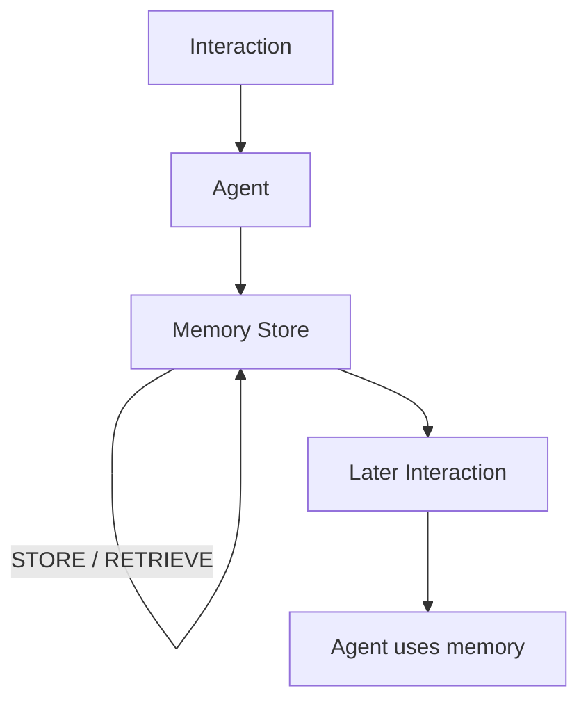

# Agent Memory

**Example ID:** `agent-memory`

## What You Will Build

A small, measured **memory runtime**: the application stores information from
one interaction, retrieves it by scope and key in a later interaction, and
compares stored memory with a current authoritative source when the two
differ.

```text
Interaction
    ↓
Agent
    ↓
Memory Store
    ↑
 STORE / RETRIEVE
    │
    ↓
Later Interaction
    ↓
Agent uses memory
```

> Agent Loop controls what happens next. Planning controls an explicit
> sequence of intended work. Memory provides information from previous
> interactions that can be retrieved and used later.

This is an explanatory example of **memory as an application-managed
information source**, not a claim that agents “remember” like humans, and
not a production memory product.

## What agent memory means

Memory is not “a Python dictionary the model can see.” It is an
application-owned record with:

- an owner / **scope** (here, a user id)
- a **key** / identity
- stored **content**
- **provenance** (where the content came from)
- **version / freshness** metadata
- explicit **retrieve** semantics, including miss and stale

The model/case harness may **propose** a store or a retrieve. The
application **validates** scope, key, value, and provenance, then performs
the operation.

### Memory lifecycle

STORE → RETRIEVE → USE

## Memory vs Agent Loop

**Agent Loop** answers:

> How does an application repeatedly let the model choose the next action?

**Memory** answers:

> How does an application persist information from one interaction and
> make it available to a later interaction?

```text
Agent Loop

Model → next action → Observation
          ↑
          └──────── Model → next action → ...
```

versus:

```text
Memory

Interaction 1 → STORE → Memory record
                              ↓
Interaction 2 → RETRIEVE → USE recalled content
```

The [Agent Loop](../02-agent-loop) example covers repeated next-action
selection under application-owned state and termination.

This example focuses on:

- explicit store
- explicit retrieve
- scope isolation
- provenance
- freshness / stale memory
- cross-interaction recall

Memory is not a replacement for a loop. A loop still decides what happens
next. Memory supplies information that the current interaction does not
contain.

| Concern | Agent Loop (02) | Memory (05) |
|---------|-----------------|-------------|
| Primary lesson | next action is selected repeatedly | prior information is stored and retrieved |
| Model role | propose the next tool or answer | propose store, retrieve, or answer |
| Persistence | state within one run | records that outlive an interaction |
| Identity | turn / observation lists | scope + key + version |
| Failure | invalid action / max turns | miss and stale are normal states |

## Memory vs Planning

**Planning** manages:

- planned steps
- step state
- execution progress
- plan revisions

**Memory** manages:

- information persisted beyond the current interaction
- retrieval of that information
- scope / identity
- freshness / provenance

The [Planning](../04-planning) example covers an explicit multi-step plan
as a runtime artifact. This example does not create a plan in order to
demonstrate memory.

## Memory vs RAG

> RAG retrieves external knowledge for a task. Memory retains information
> associated with previous interactions or execution.

This example does **not** implement embeddings, vector search, chunking,
reranking, or a retrieval pipeline. Lookup is deterministic by
`scope` + `key`.

| Concern | RAG | Memory (this example) |
|---------|-----|------------------------|
| What is retrieved | external documents relevant to a query | a record associated with a prior interaction |
| Identity | chunk / document ids from a corpus | scope + key owned by the application |
| Lookup | similarity / lexical ranking | exact key in a scoped store |
| Freshness | corpus version / index rebuild | record version vs current source version |

This is one engineering definition of agent memory. It is not the only
possible definition, and it is not a vector-store tutorial.

## Store

Memory begins with an explicit write. The user provides a preference; the
application stores a `MemoryRecord`. Seeing text in a prompt is not
persistence.

```text
user request
    ↓
memory write requested
    ↓
validated memory write
    ↓
memory stored
    ↓
final answer
```

The application owns the write: allowlisted key, known scope, validated
value, trusted provenance, assigned id / version / timestamps.

## Retrieve

A later interaction requests information that is not in the new user
message. The application looks up `(scope, key)`.

- **Hit** — the record is returned and may be used.
- **Miss** — `memory_not_found`. The agent must not invent the missing
  content. A miss is not a memory-system failure.

## Scope

Records are scoped to a user id (`u-1001`, `u-1002`, `u-1003`).

The session scope is application-owned. A proposal for a different scope
is rejected. A record stored for user A is never returned for user B.

## Provenance

Each stored record has a `source`:

- `user` — the user explicitly supplied the fact
- `system` / `application` — trusted application writes
- `tool` — allowed as a label, not accepted as a trusted write in this
  example

User-provided STORE records use `source=user`. Model-inferred statements
are not stored as trusted memory.

## Freshness

A memory record has `version`, `createdAt`, and `updatedAt`. The current
authoritative preference fixture has its own `version` and `updatedAt`.

Stored memory can become outdated relative to that current source.

### Stale memory

```text
MEMORY
  ↓
RETRIEVE
  ↓
CURRENT SOURCE
  ↓
COMPARE
  ↓
USE CURRENT INFORMATION
```

Stale memory is not “memory failed.” The record exists, it is retrieved,
the current source differs, and the current source is preferred.

## Application-owned memory state

| Owned by the application | May be proposed by the model/harness |
|--------------------------|--------------------------------------|
| record id / version      | key and value to store               |
| scope enforcement        | retrieve key                         |
| schema validation        | final answer text                    |
| trusted provenance check |                                      |
| current-source compare   |                                      |
| termination              |                                      |

A proposed write never bypasses scope checks, allowlists, or provenance
rules.

## Cross-interaction recall

The RECALL case uses two interactions that share a memory store and do
**not** share conversation history.

Interaction 2’s user request does not contain the stored channel. The
only way the answer can name `email` is by retrieving the record stored
in interaction 1.

Traces label every event with `interactionId` (`interaction-1`,
`interaction-2`) so a future Lab can draw the boundary.

## Observable traces

Traces contain observable decisions and memory operations only:

`user_request` → `memory_write_requested` → `memory_stored` →
(`user_request`) → `memory_retrieval_requested` →
`memory_retrieved` / `memory_not_found` → (`observation`) →
`final_answer` → `termination`

The future Interactive Lab can reconstruct what was stored, for whom,
from which source, at which version, whether it was retrieved, missing,
or stale, and what information influenced the answer.

## Provenance

Measured Cookbook traces use a **case harness** (`provenance.model=case-harness`).
Memory operations are real against the local store (`provenance.tools=measured`).
Metrics are recorded from the run (`provenance.metrics=measured`).

> The case harness makes memory decisions reproducible for this example.
> Memory operations and recorded metrics remain measured.

Live model execution is an optional CLI mode. It is not the source of
committed Lab traces. Case-harness latency is not production model
performance.

## No chain-of-thought

> The Cookbook records observable decisions and execution events only. It does
> not store or expose hidden chain-of-thought.

Traces contain store/retrieve operations, record metadata, current-source
observations, answers, and termination — not internal reasoning text.

## Operational metrics

Recorded execution only (local latency may round to 0ms):

- `totalMs`, `modelMs`, `toolMs`
- `modelTurns`, `toolCalls`
- `memoryWrites`, `memoryReads`, `memoryHits`, `memoryMisses`
- `memoryScope`, `memoryVersion`, `staleMemoryDetected`
- `terminationReason`, `maxTurns`
- `provenance: measured`

These fields describe what happened. They are not a memory-quality score.

## Measured cases

The scenario is a small support preference flow against local fixtures.

Users match the other Agent examples: Ada (`u-1001`), Grace (`u-1002`),
Alan (`u-1003`). The current source of record for Alan’s notification
channel is **SMS, version 2**. Ada and Grace have no current-source entry.

| Trace ID | Class | Demonstrates |
|----------|-------|--------------|
| `no-memory-notification-preference` | `NO_MEMORY` | Requested information is unavailable |
| `store-email-notification-preference` | `STORE` | Explicit information is persisted |
| `recall-email-notification-preference` | `RECALL` | Later interaction retrieves and uses stored information |
| `stale-memory-notification-preference` | `STALE_MEMORY` | Stored information is outdated relative to the current source |

### NO_MEMORY

An agent cannot recall information that was never stored or is outside
the available memory scope.

Grace asks how she should be notified. Nothing is stored for `u-1002` /
`notification_channel`. Lookup emits `memory_not_found`. The answer does
not invent a channel.

A miss is a normal observable state, not a failure of the memory system.

### STORE

Memory begins with an explicit write; information does not persist
automatically just because the model saw it.

Ada says she prefers email notifications. The application stores a
version-1 record scoped to `u-1001` with provenance `user`.

### RECALL

Memory allows information from an earlier interaction to influence a
later interaction.

Interaction 1 stores Ada’s email preference. Interaction 2 asks how she
should be notified and does **not** repeat `email`. The runtime retrieves
the stored record. The answer uses that recalled channel.

### STALE_MEMORY

Memory is context, not automatically the latest source of truth.

Interaction 1 stores Alan’s email preference (memory version 1).
Interaction 2 retrieves that record, then observes the current
authoritative source: SMS, version 2. The record is stale. The final
answer uses SMS. The stored record remains observable; it is not deleted
and is not reported as a store error.

## Architecture



```text
┌────────────┐  propose store / retrieve / answer  ┌──────────────────────┐
│   Model    │ ─────────────────────────────────► │  Application runtime │
│ (harness)  │                                    │  • MemoryStore       │
└────────────┘                                    │  • scope / key       │
       ▲                                          │  • provenance        │
       └──── retrieved record / current source ── │  • freshness compare │
                                                  │  • termination       │
                                                  └──────────────────────┘
```

Memory operations are not selected as generic data tools. They run only
as validated store/retrieve operations. The current preference fixture is
a separate authoritative source, not a vector index.

## Termination contract

| Reason | When |
|--------|------|
| `final_answer` | Session completed and a final answer was recorded |
| `max_turns` | Turn budget exhausted (safety boundary) |
| `invalid_action` | Unrecognized action or invalid memory proposal |
| `error` | Reserved for hard runtime failures (not used in measured cases) |

`memory_not_found` is not a termination reason. A miss is followed by an
honest final answer. Stale memory is not `error` either: the session still
terminates with `final_answer` after preferring the current source.

## Run It

```bash
cd examples/agents/05-memory
uv sync --extra dev

# Measured cases (no paid API)
uv run python main.py --list-cases
uv run python main.py --case no-memory-notification-preference --show-sequence
uv run python main.py --case store-email-notification-preference --show-sequence
uv run python main.py --case recall-email-notification-preference --show-sequence
uv run python main.py --case stale-memory-notification-preference --show-sequence

# Export Lab traces
uv run python export_lab_traces.py

# Tests
uv run pytest -q
```

Optional live mode (requires `OPENAI_API_KEY` in `.env`):

```bash
cp .env.example .env
uv run python main.py "I prefer email notifications for service incidents."
```

Live mode is separate from measured Cookbook traces.

## Configuration

| Setting | Default | Role |
|---------|---------|------|
| `MAX_TURNS` | `6` | Hard bound on model consultations |
| `TOOL_TIMEOUT_MS` | `2000` | Kept for config parity with other Agent examples |
| `CHAT_MODEL` | `gpt-4o-mini` | Live mode only |

## Key code

| File | Role |
|------|------|
| `agent/memory.py` | MemoryRecord, MemoryStore, validation, freshness |
| `agent/source.py` | Current authoritative preference fixture |
| `agent/state.py` | Serializable runtime state including interaction boundaries |
| `agent/loop.py` | STORE / RETRIEVE across interactions |
| `agent/cases.py` | Four deterministic measured cases |
| `agent/trace.py` | Lab traces + presentation metadata |
| `export_lab_traces.py` | Write `lab_traces.json` |

## Engineering safety / limitations

- Deterministic local memory store — not a production persistence layer
- Small fixture set (three users, one memory key)
- Explicit key-based retrieval — no semantic search, embeddings, or RAG
- No automatic memory consolidation or summarization
- No forgetting strategy beyond the demonstrated miss / stale semantics
- No hidden reasoning stored or displayed
- Not a memory framework, evaluator, planner, or multi-agent orchestrator
- Not a benchmark; four cases cannot represent production memory quality
- Operational counts are not a “memory quality” or “memory accuracy” score
- Case harness turns are reproducible example fixtures, not live model scores
- Live mode is optional and is not used for committed traces

This implementation does not represent every production memory
architecture.

This lab remains focused on:

**STORE → RETRIEVE → USE**

## Tests

```bash
uv run pytest -q
uv run ruff check .
```

## Where it fits

```text
AI AGENTS
  01 Tool Calling
  02 Agent Loop
  03 Agent Evaluation
  04 Planning
  05 Memory  ← you are here
```

## Why this is not a benchmark

- Four deterministic cases
- One local fixture set
- A scripted case harness, not a live model leaderboard
- No composite memory-quality score
- No claim that memory beats RAG, loops, or planning in general
- No claim about other agents, vendors, or production traffic
