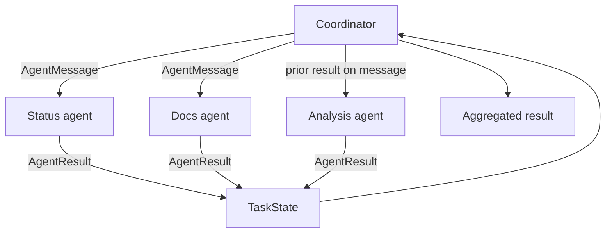

# Multi-Agent Collaboration

**Example ID:** `multi-agent-collaboration`

## What this example demonstrates

A measured **multi-agent collaboration runtime**: an application-owned
coordinator assigns work to specialized agents, agents communicate through
explicit messages, shared task state is updated only by the coordinator, and
the coordinator aggregates the **actual** specialist results before an
explicit termination.

```text
Coordinator
    │
    ├── delegates work
    │
    ▼
Specialized agents
    │
    ├── explicit AgentMessage / AgentResult
    │
    ▼
Shared TaskState (coordinator-owned)
    │
    ▼
Coordinator aggregation
    │
    ▼
Final result / recorded failure / no further work
```

This is a reference implementation of collaboration mechanics. It is not an
autonomous swarm, not an agent-handoff protocol, not a planner, not a memory
system, and not a production orchestration framework.

## 1. Progression

| Example | Focus |
|---------|--------|
| Agents #1 | One agent calling tools |
| Agents #2 | One agent looping on application-owned state |
| Agents #3 | Evaluating one agent run |
| Agents #4 | An explicit plan as a runtime artifact |
| Agents #5 | Memory across interactions |
| **Agents #6** | **Multiple specialized agents + coordinator-owned collaboration** |

What #6 adds: distinct agent identities and roles, coordinator routing,
explicit inter-agent messages, shared task state that specialists cannot
write, and aggregation of actual upstream results.

A single agent with tools can fetch status and docs. This example separates
those roles into runtime participants so delegation, messaging, failure, and
skip/termination are observable.

## 2. Architectural boundary

| Concept | This example |
|---------|----------------|
| Multi-agent collaboration | Yes — coordinator + specialists + messages |
| Agent handoff | No — control stays with the coordinator |
| Planning | No — routing is an explicit coordinator workflow |
| Memory | No — no cross-interaction store |
| Orchestration framework | No — small application-owned runtime |

```text
coordinator
    ↓
delegate work
    ↓
specialized agents
    ↓
explicit messages / results
    ↓
shared task state
    ↓
coordinator aggregation
    ↓
final result
```

## 3. Runtime participants

| Participant | Role | Owns |
|-------------|------|------|
| Coordinator | Route, record, terminate, aggregate | `TaskState`, delegation, termination |
| `status_agent` | Service status lookup | Status catalog only |
| `docs_agent` | Documentation lookup | Docs catalog only |
| `analysis_agent` | Interpret a prior status result | Inbound `AgentMessage` payload only |

Agents return `AgentResult`. They do not mutate `TaskState`. Specialists are
deterministic runtime participants (catalog lookup or inbound-message
analysis), not LLM-powered autonomous agents. Optional `--live` synthesis
only formats the final brief from actual `TaskState` results.

## 4. Data flow

Information moves through the runtime:

- Independent work: each specialist receives only its assignment.
- Sequential work: the analysis agent receives `payload.prior_result` copied
  from the status agent's **actual** `AgentResult.payload`.
- Aggregation: the mock synthesizer formats `TaskState.results`. It does not
  reload `services.json` or `docs.json`.

The analysis agent does not import the status catalog. Tests inject a sentinel
status result to prove analysis is grounded in the inbound message.

## 5. Measured cases

| Trace ID | Class | Workflow |
|----------|-------|----------|
| `independent-status-and-docs` | `BASIC_COLLABORATION` | Status and docs run independently; coordinator aggregates both results |
| `sequential-status-then-analysis` | `SEQUENTIAL_COLLABORATION` | Status result is passed to analysis, then aggregated |
| `docs-agent-failure` | `AGENT_FAILURE` | Docs agent fails; coordinator aggregates a failure brief from actual results; analysis is not invoked; `ok` remains false |
| `operational-short-circuit` | `COLLABORATION_TERMINATION` | Operational billing → analysis skipped → terminate with no further work |

## 6. Termination

| Reason | When |
|--------|------|
| `aggregated` | Coordinator aggregated specialist results |
| `no_further_work` | Remaining specialists were skipped by policy |
| `agent_failed` | A specialist failed; coordinator aggregates a failure brief from actual results, then terminates. `ok` remains false |
| `max_delegations` | Delegation budget exhausted |
| `invalid_task` | Empty request |
| `error` | Unknown agent or missing upstream result |

## 7. Provenance

Mock path (CI and `lab_traces.json`):

```text
provenance:
  model:   mock
  tools:   measured    # real specialist executions
  metrics: measured
```

Optional live synthesis (`--live`) calls a provider with the **actual**
specialist results. It is not the source of committed traces. CI does not
require an API key.

## 8. No-CoT policy

Traces store observable task, delegation, message, result, state, aggregation,
failure, and termination events. There is no chain-of-thought or scratchpad.

## Architecture



### Signature flows

```text
BASIC_COLLABORATION:         TASK → DELEGATE → AGENT → DELEGATE → AGENT → AGGREGATE → TERMINATION
SEQUENTIAL_COLLABORATION:    TASK → DELEGATE → AGENT → DELEGATE → PASS_RESULT → AGENT → AGGREGATE → TERMINATION
AGENT_FAILURE:               TASK → DELEGATE → AGENT → DELEGATE → AGENT → FAILURE → AGGREGATE → TERMINATION
COLLABORATION_TERMINATION:   TASK → DELEGATE → AGENT → SKIP → AGGREGATE → TERMINATION
```

Signature flows omit the coordinator's `AGGREGATE_DECISION`. `AGENT` is the
specialist result (after `handle`), not `agent_selected`. `PASS_RESULT` is
the inbound message that carries a parent result; the runtime emits that
message before the downstream specialist runs. Failure still includes
`AGGREGATE` because the coordinator synthesizes a brief from actual
specialist results before terminating.

## Project layout

```text
examples/agents/06-multi-agent-collaboration/
├── README.md
├── pyproject.toml
├── config.py
├── main.py
├── export_lab_traces.py
├── lab_traces.json
├── data/
├── agent/
│   ├── agents.py
│   ├── catalog.py
│   ├── cases.py
│   ├── runtime.py
│   ├── schemas.py
│   ├── state.py
│   ├── synthesizer.py
│   └── trace.py
└── tests/
```

## Quick start

```bash
cd examples/agents/06-multi-agent-collaboration
uv sync --extra dev

uv run python main.py --case independent-status-and-docs --show-sequence
uv run python main.py --case sequential-status-then-analysis --show-sequence
uv run python main.py --case docs-agent-failure --show-sequence
uv run python main.py --case operational-short-circuit --show-sequence

uv run pytest -q
uv run python export_lab_traces.py
```

Optional live synthesis of the final brief (requires an API key; never used
by CI or committed traces):

```bash
cp .env.example .env   # add OPENAI_API_KEY
uv run python main.py --case sequential-status-then-analysis --live
```

Requires Python 3.12+ and [uv](https://docs.astral.sh/uv/).

## Design boundaries

- **Collaboration, not a framework** — no LangGraph, CrewAI, or AutoGen
- **Coordinator owns state** — specialists return results; they do not write `TaskState`
- **Actual data flow** — sequential analysis uses the upstream `AgentResult`
- **Deterministic mock path** — CI has no API key dependency
