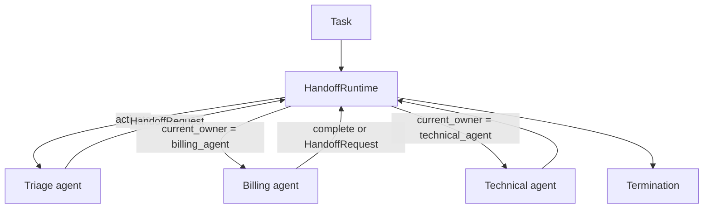

# Agent Handoffs

**Example ID:** `agent-handoffs`

## What this example demonstrates

A measured **agent handoff runtime**: the currently active agent transfers
responsibility for the task to another agent. The application owns the
runtime, the handoff contract, ownership state, validation, and
termination.

```text
User / task
    │
    ▼
Triage agent          ← current owner
    │
    │ handoff (ownership transfer)
    ▼
Billing agent         ← current owner
    │
    │ handoff (ownership transfer)
    ▼
Technical agent       ← current owner
    │
    ▼
Completion / failure / rejected handoff
    │
    ▼
Termination
```

This is a reference implementation of ownership transfer. It is not
multi-agent collaboration, not a coordinator that delegates and takes
control back, not a planner, not a memory system, and not a production
orchestration framework.

## Collaboration vs handoff

| | Agents #6 Collaboration | Agents #7 Handoffs |
|---|-------------------------|-------------------|
| Who stays in control | The coordinator | The current owner, until it transfers |
| After a specialist runs | Control returns to the coordinator | The previous owner is no longer active |
| Core verb | `DELEGATE` | `HANDOFF` |
| Shared pattern | Coordinator assigns work, records results, aggregates | Runtime validates a handoff request and replaces `current_owner` |

```text
Collaboration:
    coordinator retains orchestration control and delegates work.

Handoff:
    the active agent transfers responsibility to another agent.
```

A handoff is not `coordinator -> another agent`. After a successful
handoff, `current_owner` is the receiving agent. The runtime does not
return to a coordinator to decide the next specialist.

## 1. Progression

| Example | Focus |
|---------|--------|
| Agents #1 | One agent calling tools |
| Agents #2 | One agent looping on application-owned state |
| Agents #3 | Evaluating one agent run |
| Agents #4 | An explicit plan as a runtime artifact |
| Agents #5 | Memory across interactions |
| Agents #6 | Coordinator-owned collaboration across specialists |
| **Agents #7** | **Active-owner handoff: responsibility transfer** |

What #7 adds: an explicit handoff contract, a single current owner,
runtime validation of handoff targets, ownership transitions in state
and traces, and downstream consumption of the actual handoff payload.

## 2. Architectural boundary

| Concept | This example |
|---------|----------------|
| Agent handoffs | Yes — ownership transfer between specialists |
| Multi-agent collaboration | No — there is no coordinator retaining control |
| Planning | No — specialists request handoffs from their own results |
| Memory | No — no cross-interaction store |
| Orchestration framework | No — small application-owned runtime |

```text
task
    ↓
activate current owner
    ↓
owner result: complete | fail | handoff request
    ↓
runtime validates handoff
    ↓
ownership transferred  (or rejected)
    ↓
new owner  (previous owner is inactive)
    ↓
termination
```

## 3. Runtime participants

| Participant | Role | Owns |
|-------------|------|------|
| `HandoffRuntime` | Validate, transfer ownership, terminate | `HandoffState`, current owner |
| `triage_agent` | Classify the ticket and request a handoff | `TicketStore` only |
| `billing_agent` | Resolve invoice work from the inbound handoff | `InvoiceStore` + inbound payload |
| `technical_agent` | Diagnose a system incident from the inbound handoff | `SystemStore` + inbound payload |

Agents return `AgentResult`. They do not mutate `HandoffState` and they
do not call one another. Specialists are deterministic runtime
participants. Optional `--live` formatting only rewrites the terminating
owner's actual result; it does not aggregate independent delegations.

At any point in the chain there is **one active owner**.

## 4. Handoff contract

```text
HandoffRequest
    from_agent
    to_agent
    reason
    context / payload
    parent_result_id
```

`AgentResult.kind` distinguishes outcomes:

| kind | Meaning |
|------|---------|
| `handoff` | Owner requests an ownership transfer |
| `complete` | Owner finished the task |
| `failure` | Owner failed; runtime records failure and terminates |

The runtime may reject a handoff (`unknown_target`, `self_handoff`,
`empty_target`, `not_current_owner`, `max_handoffs`) without transferring
ownership. Invalid targets are not silently rerouted. `from_agent` and
`to_agent` are normalized before validation and transfer. A result whose
`agent_id` does not match `current_owner` is recorded as `owner_mismatch`
and does not complete or transfer.

Every accepted handoff has explicit provenance: `from_agent`, `to_agent`,
`reason`, and `parent_result_id` pointing at the result that requested it.

## 5. Data flow

Information moves through the handoff payload:

```text
TriageResult.payload
    │
    ▼
HandoffRequest.payload
    │
    ▼
BillingAgent  (uses inbound invoice_id, not the original ticket catalog)
    │
    ▼
BillingResult / HandoffRequest.payload
    │
    ▼
TechnicalAgent  (uses inbound system_id, not invoices or tickets)
```

Billing does not parse the original request to discover the invoice.
Technical does not reload invoices. The runtime passes `request` and
`ticket_id` only to the initial owner on `AgentContext`. Triage does not
copy `ticket_id` into `HandoffRequest.payload`. Downstream owners receive
the inbound handoff and a specialist-specific store (`InvoiceStore` or
`SystemStore`) with no ticket access. Tests inject a sentinel value that
is not in the fixture catalogs to prove the receiving agent consumed the
actual handoff payload.

## 6. Measured cases

| Trace ID | Class | Workflow |
|----------|-------|----------|
| `invoice-duplicate-basic-handoff` | `BASIC_HANDOFF` | Triage hands off to billing; billing completes |
| `refund-blocked-multi-hop` | `MULTI_HOP_HANDOFF` | Triage → billing → technical; two ownership transfers |
| `legal-target-invalid-handoff` | `INVALID_HANDOFF` | Triage requests `legal_agent`; runtime rejects; no reroute |
| `unknown-system-handoff-failure` | `HANDOFF_FAILURE` | Triage → billing → technical; technical fails; `ok` remains false |

## 7. Termination

| Reason | When |
|--------|------|
| `completed` | Current owner finished the task |
| `invalid_handoff` | Runtime rejected the handoff contract; owner does not change |
| `agent_failed` | Current owner failed; recorded as failure, not success |
| `max_handoffs` | Handoff budget exhausted |
| `invalid_task` | Empty request |
| `error` | Unknown initial agent or invalid owner outcome |

## 8. Provenance

Mock path (CI and `lab_traces.json`):

```text
provenance:
  model:   mock
  tools:   measured    # real specialist executions
  metrics: measured
```

Optional live formatting (`--live`) calls a provider with the
**terminating owner's actual result**. It is not the source of committed
traces. CI does not require an API key.

## 9. No-CoT policy

Traces store observable task, activation, result, handoff, ownership,
completion, failure, and termination events. There is no chain-of-thought
or scratchpad. There is no composite quality score.

## Architecture



### Signature flows

```text
BASIC_HANDOFF:      TASK → AGENT → HANDOFF → AGENT → COMPLETE → TERMINATION
MULTI_HOP_HANDOFF:  TASK → AGENT → HANDOFF → AGENT → HANDOFF → AGENT → COMPLETE → TERMINATION
INVALID_HANDOFF:    TASK → AGENT → HANDOFF → HANDOFF_REJECTED → TERMINATION
HANDOFF_FAILURE:    TASK → AGENT → HANDOFF → AGENT → HANDOFF → AGENT → FAILURE → TERMINATION
```

Signature flows omit `AGENT_ACTIVATED`, `HANDOFF_ACCEPTED`, and
`OWNERSHIP_TRANSFERRED`. `AGENT` is the owner result after `handle`.
`HANDOFF` is `handoff_requested` — not a coordinator `DELEGATE`. The full
sequence still records activation, acceptance, and the ownership
transition so tests can assert `current_owner` changed.

## Project layout

```text
examples/agents/07-agent-handoffs/
├── README.md
├── pyproject.toml
├── config.py
├── main.py
├── export_lab_traces.py
├── lab_traces.json
├── data/
├── agent/
│   ├── agents.py
│   ├── catalog.py
│   ├── cases.py
│   ├── runtime.py
│   ├── schemas.py
│   ├── state.py
│   ├── synthesizer.py
│   └── trace.py
└── tests/
```

## Quick start

```bash
cd examples/agents/07-agent-handoffs
uv sync --extra dev

uv run python main.py --case invoice-duplicate-basic-handoff --show-sequence
uv run python main.py --case refund-blocked-multi-hop --show-sequence
uv run python main.py --case legal-target-invalid-handoff --show-sequence
uv run python main.py --case unknown-system-handoff-failure --show-sequence

uv run pytest -q
uv run python export_lab_traces.py
```

Optional live formatting of the terminating owner's result (requires an
API key; never used by CI or committed traces):

```bash
cp .env.example .env   # add OPENAI_API_KEY
uv run python main.py --case refund-blocked-multi-hop --live
```

Requires Python 3.12+ and [uv](https://docs.astral.sh/uv/).

## Design boundaries

- **Handoff, not collaboration** — no coordinator retains control after a transfer
- **Application-owned runtime** — no LangGraph, CrewAI, or AutoGen
- **One active owner** — a successful handoff replaces `current_owner`
- **Actual data flow** — downstream agents consume the inbound handoff payload
- **Deterministic mock path** — CI has no API key dependency

## Limitations

- Specialists are deterministic catalog/payload participants, not LLM-powered
  autonomous agents. Optional `--live` only formats the terminating owner's
  actual result.
- Handoff policy lives in the specialists and the runtime validator, not in a
  learned router.
- There is no return-to-sender, no parallel owners, and no coordinator
  aggregation of independent specialist work. Those are Agents #6 concerns.
- Invalid handoffs terminate rather than recovering by picking another target.
