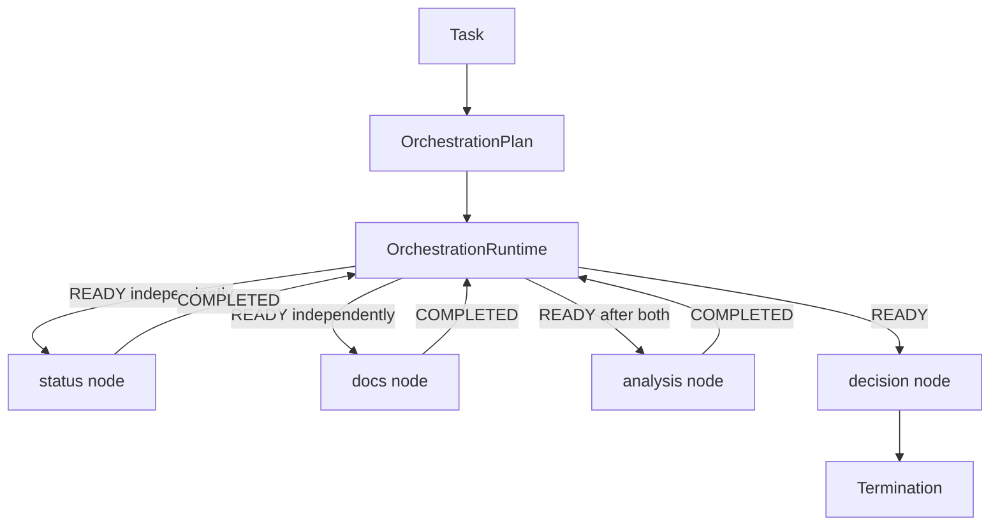

# Agent Orchestration

**Example ID:** `agent-orchestration`

## What this example demonstrates

A measured **agent orchestration runtime**: an application-owned orchestrator
controls a workflow of agent executions from an explicit plan. Nodes become
executable only when dependencies, readiness, and conditions say they may.

```text
Application-owned orchestrator
    │
    ▼
OrchestrationPlan   ← runtime artifact (nodes, dependencies, conditions)
    │
    ▼
Node state machine  PENDING → READY → RUNNING → COMPLETED | FAILED
                    PENDING → SKIPPED
    │
    ▼
Ready nodes execute; downstream nodes consume actual upstream results
    │
    ▼
Conditional branches, skipped nodes, failure propagation
    │
    ▼
Termination
```

This is a reference implementation of workflow orchestration. It is not
multi-agent collaboration, not ownership transfer, not a planner, not a
memory system, and not a production orchestration framework.

## Collaboration vs handoff vs orchestration

| | Agents #6 Collaboration | Agents #7 Handoffs | Agents #8 Orchestration |
|---|-------------------------|-------------------|-------------------------|
| Who stays in control | The coordinator | The current owner, until it transfers | The application-owned orchestrator |
| After a specialist runs | Control returns to the coordinator | The previous owner is no longer active | The runtime recomputes which plan nodes are READY |
| Core verb | `DELEGATE` | `HANDOFF` | `READY` |
| Shared pattern | Coordinator assigns work, records results, aggregates | Runtime validates a handoff and replaces `current_owner` | Runtime executes a plan graph from dependencies and conditions |

```text
Collaboration:
    coordinator retains control and delegates work.

Handoff:
    the active agent transfers responsibility to another agent.

Orchestration:
    the application owns a workflow plan and decides WHEN each node may run.
```

Orchestration is not `coordinator -> another agent` and not `owner -> new owner`.
The plan is the scheduling authority. A node is not executable merely because
it exists in the plan.

## 1. Progression

| Example | Focus |
|---------|--------|
| Agents #1 | One agent calling tools |
| Agents #2 | One agent looping on application-owned state |
| Agents #3 | Evaluating one agent run |
| Agents #4 | An explicit plan as a runtime artifact |
| Agents #5 | Memory across interactions |
| Agents #6 | Coordinator-owned collaboration across specialists |
| Agents #7 | Active-owner handoff: responsibility transfer |
| **Agents #8** | **Application-owned orchestration of a workflow graph** |

What #8 adds: an inspectable orchestration plan, an explicit node state
machine, dependency-aware readiness, logically independent nodes, real
conditional branching with explicit SKIP, failure propagation, and
downstream consumption of actual upstream runtime results.

## 2. Architectural boundary

| Concept | This example |
|---------|----------------|
| Agent orchestration | Yes — plan, readiness, branching, failure policy |
| Multi-agent collaboration | No — there is no coordinator `DELEGATE` loop |
| Agent handoff | No — there is no `current_owner` transfer |
| Planning | No — the plan is supplied as a measured workflow, not proposed by a model |
| Memory | No — no cross-interaction store |
| Orchestration framework | No — small application-owned runtime |

```text
task
    ↓
create inspectable plan
    ↓
PENDING nodes
    ↓
compute READY from dependencies / conditions
    ↓
execute READY wave
    ↓
record COMPLETED | FAILED | SKIPPED
    ↓
recompute readiness
    ↓
termination
```

## 3. Runtime participants

| Participant | Role | Owns |
|-------------|------|------|
| `OrchestrationRuntime` | Readiness, execution waves, skip/fail policy, terminate | `OrchestrationState`, plan, node states |
| `status_agent` | Service status lookup | `StatusStore` only |
| `docs_agent` | Documentation lookup | `DocsStore` only |
| `analysis_agent` | Interpret actual status/docs results | Inbound upstream results only |
| `decision_agent` | Operational outcome from analysis | Inbound analysis result only |
| `remediation_agent` | Incident branch | Inbound analysis result only |
| `no_action_agent` | No-incident branch | Inbound analysis result only |

Agents return `AgentResult`. They do not mutate `OrchestrationState` and they
do not call one another. Specialists are deterministic runtime participants.
Optional `--live` formatting only rewrites the actual workflow outcome; it
does not schedule nodes.

The orchestrator controls **when** a node may execute. Independent nodes can
be READY at the same time.

## 4. Orchestration plan

The workflow is an inspectable runtime artifact:

```text
OrchestrationPlan
    plan_id
    nodes: OrchestrationNode[]

OrchestrationNode
    node_id
    agent_id
    dependencies
    condition?   source_node_id + field + equals
    assignment
```

A node with no dependencies can become READY immediately. A node with
dependencies becomes READY only after every required dependency is
`COMPLETED`. A failed or skipped dependency does not produce a READY node.

## 5. Node states

States are explicit. They are not a boolean.

| State | Meaning |
|-------|---------|
| `PENDING` | In the plan; not yet schedulable |
| `READY` | Dependencies and conditions are satisfied; may execute |
| `RUNNING` | Currently executing |
| `COMPLETED` | Produced an `ok` result |
| `FAILED` | Produced a failed result; preserved as failure |
| `SKIPPED` | Will not execute; reason is recorded |

Valid transitions:

```text
PENDING → READY → RUNNING → COMPLETED
PENDING → READY → RUNNING → FAILED
PENDING → SKIPPED
```

Invalid transitions are rejected. A `COMPLETED` node cannot run again. A
`SKIPPED` node cannot execute. A `FAILED` node cannot become `COMPLETED`.

## 6. Dependency resolution and logical parallelism

Readiness is calculated from the plan, not from a scripted call order.

Independent nodes (no edge between them) become READY in the same scheduling
wave **before** either executes. That is logical parallelism: independently
schedulable work. This example does not use OS threads or processes.

```text
status ──────┐
             ├──> analysis ──> decision
docs ────────┘
```

`analysis` stays PENDING until both `status` and `docs` are COMPLETED. The
trace records why a node became ready (`no_dependencies` or
`dependencies_completed`) and which upstream result IDs enabled it.

## 7. Data flow

The dependency graph is also the data-flow graph.

```text
status result ──┐
                ├──> analysis.upstream_results ──> decision.upstream_results
docs result ────┘
```

Downstream agents do not reload upstream fixture catalogs. Tests inject a
sentinel value that is not in `services.json` / `docs.json` to prove the
downstream node consumed the actual upstream runtime result.

## 8. Conditional branching

Conditions are evaluated from actual upstream runtime data.

```text
analysis.payload.incident
    │
    +---- true  → remediation  READY → execute
    │
    +---- false → no_action    SKIPPED (condition_not_selected)
```

Only the selected branch executes. The non-selected branch is explicitly
`SKIPPED` with reason `condition_not_selected`. The runtime does not execute
both branches and discard one result afterward.

## 9. Failure propagation

If a required upstream node fails:

- the failure is preserved
- no fabricated result is created
- dependents that need that result are `SKIPPED`
- skip reasons are `dependency_failed` or `dependency_skipped`
- the workflow terminates as `workflow_failed`
- `ok` remains false

Example:

```text
status    = FAILED
analysis  = SKIPPED   (dependency_failed)
decision  = SKIPPED   (dependency_skipped)
termination = workflow_failed
```

## 10. Measured cases

| Trace ID | Class | Workflow |
|----------|-------|----------|
| `payments-incident-basic-orchestration` | `BASIC_ORCHESTRATION` | status and docs READY independently; analysis after both; decision after analysis |
| `payments-status-dependency-chain` | `DEPENDENCY_CHAIN` | status → analysis → decision; exact order |
| `payments-incident-conditional-branch` | `CONDITIONAL_BRANCH` | incident=true → remediation executes; no_action SKIPPED |
| `unknown-service-orchestration-failure` | `ORCHESTRATION_FAILURE` | status fails; analysis and decision SKIPPED; not success |

## 11. Termination

| Reason | When |
|--------|------|
| `completed` | Every node is COMPLETED or SKIPPED; none FAILED; none left READY or RUNNING |
| `workflow_failed` | At least one node FAILED; dependents skipped |
| `invalid_plan` | Plan failed validation (cycle, missing dependency, …) |
| `invalid_task` | Empty request |
| `error` | Unresolved PENDING/READY/RUNNING nodes, missing condition source, or execution budget exhausted |

## 12. Provenance

Mock path (CI and `lab_traces.json`):

```text
provenance:
  model:   mock
  tools:   measured    # real specialist executions
  metrics: measured
```

Optional live formatting (`--live`) calls a provider with the **actual**
workflow results. It is not the source of committed traces. CI does not
require an API key.

## 13. No-CoT policy

Traces store observable task, plan, ready, result, skip, condition,
completion, failure, and termination events. There is no chain-of-thought
or scratchpad. There is no composite quality score. There is no `DELEGATE`
or `HANDOFF` phase.

## Architecture



### Signature flows

```text
BASIC_ORCHESTRATION:     TASK → PLAN → READY → READY → AGENT → AGENT → READY → AGENT → READY → AGENT → COMPLETE → TERMINATION
DEPENDENCY_CHAIN:        TASK → PLAN → READY → AGENT → READY → AGENT → READY → AGENT → COMPLETE → TERMINATION
CONDITIONAL_BRANCH:      TASK → PLAN → READY → AGENT → READY → AGENT → CONDITION → READY → CONDITION → SKIP → AGENT → COMPLETE → TERMINATION
ORCHESTRATION_FAILURE:   TASK → PLAN → READY → AGENT → FAILURE → SKIP → SKIP → TERMINATION
```

Signature flows omit `NODE_STARTED` and `NODE_COMPLETED`. `READY` is the
scheduling decision. `AGENT` is the node result. `CONDITION` / `SKIP` make
branch selection visible. `READY` is not `DELEGATE`. It is not `HANDOFF`.

## Project layout

```text
examples/agents/08-agent-orchestration/
├── README.md
├── pyproject.toml
├── config.py
├── main.py
├── export_lab_traces.py
├── lab_traces.json
├── data/
├── agent/
│   ├── agents.py
│   ├── catalog.py
│   ├── cases.py
│   ├── plan.py
│   ├── runtime.py
│   ├── schemas.py
│   ├── state.py
│   ├── synthesizer.py
│   └── trace.py
└── tests/
```

## Quick start

```bash
cd examples/agents/08-agent-orchestration
uv sync --extra dev

uv run python main.py --case payments-incident-basic-orchestration --show-sequence
uv run python main.py --case payments-status-dependency-chain --show-sequence
uv run python main.py --case payments-incident-conditional-branch --show-sequence
uv run python main.py --case unknown-service-orchestration-failure --show-sequence

uv run pytest -q
uv run python export_lab_traces.py
```

Optional live formatting of the actual workflow outcome (requires an API
key; never used by CI or committed traces):

```bash
cp .env.example .env   # add OPENAI_API_KEY
uv run python main.py --case payments-incident-basic-orchestration --live
```

Requires Python 3.12+ and [uv](https://docs.astral.sh/uv/).

## Design boundaries

- **Orchestration, not collaboration** — no coordinator retains a `DELEGATE` loop
- **Orchestration, not handoff** — no `current_owner` transfer
- **Application-owned runtime** — no LangGraph, CrewAI, or AutoGen
- **Plan-driven readiness** — a node executes only when the runtime marks it READY
- **Actual data flow** — downstream agents consume upstream `AgentResult` payloads
- **Identity is not rewritten** — a result whose `agent_id`, `node_id`, or `role` does not match the planned node fails that node
- **Deterministic mock path** — CI has no API key dependency

## Limitations

- Specialists are deterministic catalog/payload participants, not LLM-powered
  autonomous agents. Optional `--live` only formats the actual workflow outcome.
- "Parallel" means independently READY in the same scheduling wave, not
  simultaneous threads.
- Conditions are explicit field equality on an upstream payload, not a
  general rules engine.
- The plan is supplied by the measured case. This example does not learn or
  revise the workflow graph at runtime. Plan creation/revision is Agents #4.
- There is no coordinator aggregation of independent specialist briefs as the
  success path. Terminal node results are the workflow outcome.
