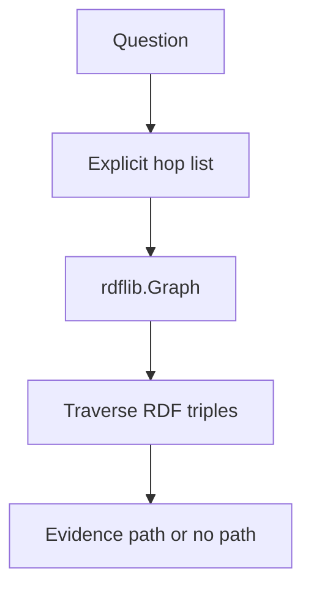

# RDF & Graph Traversal

**Example ID:** `graph-traversal`

## What this example teaches

Knowledge is represented as **RDF triples**. An application can **traverse**
those triples and return **evidence** — the path that was followed.

```text
ENTITY → RELATIONSHIP → RDF GRAPH → TRAVERSAL → EVIDENCE
```

This is not an AI agent. It is not retrieval over document chunks. It is not
GraphRAG. No LLM is required. No SPARQL is used in this example.

The central idea:

> A knowledge graph represents entities and their relationships explicitly,
> allowing applications to traverse those relationships and answer
> relationship-based questions.

## RDF

RDF represents knowledge as triples:

```text
subject → predicate → object
```

Every stored fact in this example is an RDF triple in an `rdflib.Graph`.

Examples from the Turtle fixture:

```text
ex:acmeAI            ex:employs   ex:alice
ex:alice             ex:worksOn   ex:knowledgePlatform
ex:knowledgePlatform ex:uses      ex:postgresql
```

## IRIs

Entities are identified with stable IRIs in:

```text
https://dataaihub.co/example/kg/
```

For example:

```text
https://dataaihub.co/example/kg/alice
https://dataaihub.co/example/kg/acmeAI
https://dataaihub.co/example/kg/knowledgePlatform
```

IRIs are the identifiers. They are not Wikipedia URLs. Core entities are named
resources, not blank nodes.

## Labels

Human-readable names live in the RDF graph as `rdfs:label`:

```text
ex:alice rdfs:label "Alice" .
ex:acmeAI rdfs:label "Acme AI" .
ex:knowledgePlatform rdfs:label "Knowledge Platform" .
```

A future Interactive Lab can derive `IRI → rdfs:label` from the graph. Labels
are not a separate Python dictionary.

## Graph

The collection of triples is the RDF graph. This example loads
`data/graph.ttl` with:

```text
Graph.parse(..., format="turtle")
```

`rdflib.Graph` is the authoritative graph state.

## Traversal

Traversal is a structured hop list over that RDF graph, not a free-form query
string and not SPARQL.

**Direct** — one hop:

```text
Acme AI  --employs-->  Alice, Bob, Carol
```

The graph can **branch**. One hop from Acme AI matches three `employs` triples:

```text
Acme AI
  ├─ employs → Alice
  ├─ employs → Bob
  └─ employs → Carol
```

Visit metrics count **distinct RDF IRIs and triples encountered**, not the
number of answers.

**Multi-hop** — an explicit path of two hops:

```text
Alice
  └── worksOn → Knowledge Platform
                   └── uses → PostgreSQL
```

Outgoing hops use `Graph.objects(subject, predicate)`.
Incoming hops use `Graph.subjects(predicate, object)`.

The second hop runs only because the case asked for it. The graph does not
invent extra hops.

## Direction

Outgoing and incoming traversal follow the direction of stored RDF triples.
They do not rewrite the graph.

```text
Alice  --worksOn-->  Knowledge Platform     # outgoing from Alice
Knowledge Platform  <--worksOn--  Alice     # incoming to the project
```

The stored triple remains:

```text
subject    = ex:alice
predicate  = ex:worksOn
object     = ex:knowledgePlatform
```

Incoming means “start at the object and walk the triple backward.”

## No-path behavior

Alice does **not** have a direct `uses` triple to a technology.

```text
Alice  --uses-->  ?     # no such RDF triple
```

The measured case asks only for that one outgoing `uses` hop. The walker
reports **no path** (`pathFound: false`). It must not silently substitute:

```text
Alice → worksOn → Project → uses → Technology
```

That two-hop path exists in the graph and is what the multi-hop case measures.
It is a **different question**.

## Why no SPARQL?

> This example intentionally performs application-owned traversal
> directly over the RDF graph. SPARQL is introduced separately in a
> later example.

The application validates start IRI, predicate, direction, and maximum depth.
The RDF graph is not an arbitrary executable query surface.

## Why no GraphRAG?

> GraphRAG is a later pattern combining graph structure with retrieval
> and generation. This example focuses on the graph itself.

## RDF vs property graphs

> This Cookbook track uses RDF as its graph model. It is intentionally
> not a Neo4j-style property graph.

## Graph vs relational lookup

A relational query can recover the same facts with joins. Here the
relationship is a traversable RDF triple, not only a foreign key.

## Graph vs vector search

Vector search answers **similarity** questions. Graph traversal answers
**relationship** questions over explicit RDF predicates. Similar text is not
a triple.

## Four measured cases

| ID | Class | Question | Walk |
|----|--------|----------|------|
| `direct-relationship-employs` | `DIRECT_RELATIONSHIP` | Who does Acme AI employ? | Acme AI `--employs-->` people |
| `multi-hop-alice-technologies` | `MULTI_HOP_TRAVERSAL` | Which technologies are used by projects that Alice works on? | Alice `--worksOn-->` project `--uses-->` technology |
| `relationship-filter-project-people` | `RELATIONSHIP_FILTER` | Which people work on the Knowledge Platform project? | Knowledge Platform `<--worksOn--` people |
| `no-path-alice-uses` | `NO_PATH` | What technology does Alice use directly? | Alice `--uses-->` (no triple) |

Carol exists so case 3 is a real filter, not “return every person.”

Trace identifiers are RDF IRIs. Teaching outcomes (who is employed, which
technology Alice reaches in two hops, incoming `worksOn`, and no direct
`uses`) are unchanged from the earlier custom-store draft.

## Later in this track

These are **not implemented here**:

```text
01 — RDF & Graph Traversal     (this example)
02 — SPARQL & Graph Queries
03 — Knowledge Graph Construction
04 — GraphRAG
```

## Architecture

```text
Turtle fixture (data/graph.ttl)
        ↓
rdflib.Graph.parse(format="turtle")
        ↓
Validated hop list (predicate + direction + depth limit)
        ↓
RDF-native traversal (objects / subjects)
        ↓
Paths / no path + measured trace
```



## Traversal limit

The application owns:

- RDF graph data
- entity IRIs
- allowed predicates (`employs`, `worksOn`, `uses`)
- relationship direction
- maximum traversal depth (default 8)

A request cannot raise that ceiling. Path length greater than
`max_traversal_depth` is rejected with `depth_limit`. There is no SPARQL
endpoint and no query string, so a malformed request cannot execute code or
walk the graph unbounded.

## Provenance

There is no model in this example.

```text
provenance:
  model:   not_used
  tools:   measured    # real RDF lookup / neighbor / traversal operations
  metrics: measured    # recorded from the run
```

This is not an LLM experiment. The graph library is **rdflib**. No Stardog,
Neo4j, Neptune, embeddings library, or SPARQL engine is used.

## Metrics

Observable graph measurements only. These are teaching counts, not scores.

| Metric | Meaning |
|--------|---------|
| `entitiesVisited` | Number of **distinct RDF entity IRIs** encountered, including the start entity |
| `relationshipsVisited` | Number of **distinct RDF triples** matched during traversal |
| `matchedRelationships` | Presentation-friendly name; **currently equals** `relationshipsVisited` |
| `traversalDepth` | Number of **requested hops**, not the number of entities visited |
| `pathFound` | Whether the full hop list matched |
| `executionMs` | Local run duration |
| `terminationReason` | `completed` or `no_path` for the four cases |

`matchedRelationships` is retained as a presentation-friendly measurement name
and currently equals `relationshipsVisited`.

On the direct `employs` case, one hop branches to Alice, Bob, and Carol:

- `traversalDepth` = 1
- `relationshipsVisited` = 3
- `entitiesVisited` = 4 (Acme AI + three people)
- answers = 3

Visit counts are therefore **not** “number of answers.”

This is **not a benchmark**. There is no graph intelligence score, quality
score, answer confidence score, or RDF quality score.

## Trace events

Observable operations in `sequence`:

| Event | Meaning |
|-------|---------|
| `user_request` | Question plus explicit hops |
| `graph_lookup` | Start-entity lookup (`rdfs:label` from the RDF graph) |
| `traversal_started` | Walk begins |
| `traversal_step` | One requested hop |
| `relationship_match` | A stored RDF triple matched (omitted when none match) |
| `traversal_completed` | Walk finished |
| `result` | Answers or `pathFound: false` |
| `termination` | `completed` or `no_path` |

Matched triples record subject/predicate/object **IRIs and labels**, plus
walk `direction`. Presentation metadata (`presentation.signatureView`) is
derived for a future Interactive Lab and is **not** part of the measurement.

## This track vs other Cookbook tracks

| Track | What it measures |
|-------|------------------|
| RAG | Retrieval over documents/chunks |
| Agent tool calling | Model/application selecting tools |
| Agent planning | Explicit execution plans |
| Agent memory | Persisting information across interactions |
| MCP | Protocol for discovering/invoking server capabilities |
| **Knowledge graph (this example)** | RDF triples + explicit graph traversal |

No agent behavior is added to make the example look “AI-like.”

## No-CoT policy

Traces store **observable RDF graph operations** only. There is no
chain-of-thought, hidden reasoning, or model deliberation.

## Limitations

- Local `rdflib.Graph`, not a graph database
- Small synthetic Turtle fixture (inspectable by hand)
- Deterministic traversal over an explicit hop list
- No SPARQL
- No embeddings, vector search, or similarity ranking
- No LLM and no generation
- No GraphRAG
- No benchmark claims
- No Interactive Lab UI in this example

## Project layout

```text
examples/knowledge-graphs/01-graph-traversal/
├── README.md
├── pyproject.toml
├── config.py
├── main.py
├── export_lab_traces.py
├── lab_traces.json
├── data/graph.ttl
├── graph/
│   ├── vocab.py        # RDF namespace, predicates, IRIs
│   ├── model.py        # hop, metrics, trace events
│   ├── store.py        # rdflib.Graph load / lookup / neighbors
│   ├── traversal.py    # validated deterministic walk
│   ├── cases.py        # four measured cases
│   └── trace.py        # Lab trace builder
└── tests/
```

## Quick start

```bash
cd examples/knowledge-graphs/01-graph-traversal
cp .env.example .env   # optional overrides; no API key
uv sync
uv run python main.py --case direct-relationship-employs --show-sequence
uv run python export_lab_traces.py
uv run pytest -q
```

Requires Python 3.12+ and [uv](https://docs.astral.sh/uv/).
