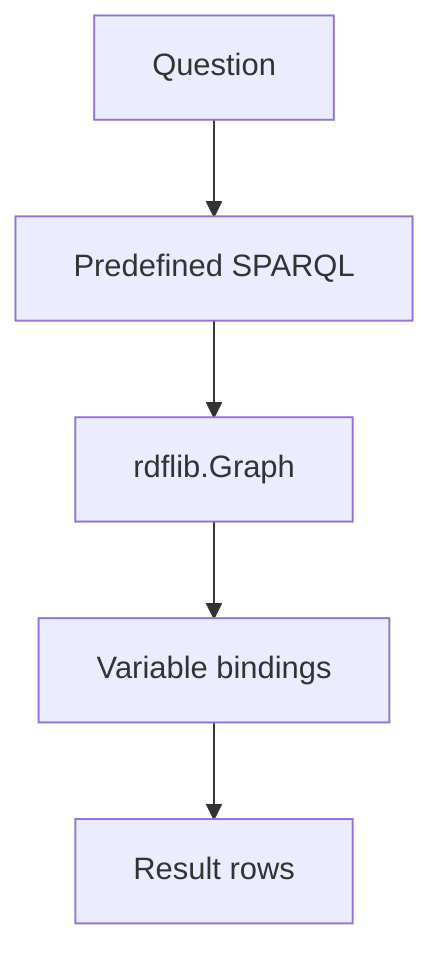

# SPARQL & Graph Queries

**Example ID:** `sparql-queries`

Follows: [01 — RDF & Graph Traversal](../01-graph-traversal/)

## What this example teaches

SPARQL is a **declarative query language** for RDF graphs. Instead of
programming each traversal hop, you **describe the graph pattern** you want
and the engine returns **variable bindings** that match.

```text
SPARQL query → triple patterns → variable bindings → result rows
```

This example queries the RDF graph **directly**. It is not GraphRAG. No LLM,
embeddings, vector database, or external graph database is used.

## From traversal to querying

**KG #1** asks:

> How do I traverse these explicit relationships?

The application owns each hop: predicate, direction, depth limit.

**KG #2** asks:

> How do I declaratively describe the pattern I want?

The application owns which predefined query runs, execution limits, result
normalization, and trace collection. The **SPARQL query** expresses the graph
pattern.

```text
KG #1:  RDF graph → application-owned traversal → path
KG #2:  RDF graph → SPARQL query pattern → bindings → result
```

## RDF graph

Knowledge is stored as RDF triples:

```text
subject → predicate → object
```

The authoritative graph is `data/graph.ttl`, loaded into `rdflib.Graph`.
Entities use IRIs in `https://dataaihub.co/example/kg/` with human-readable
`rdfs:label` values — the same conceptual domain as KG #1 (Acme AI, Alice,
Bob, Carol, Knowledge Platform, Billing Portal, PostgreSQL, Redis).

KG #2 adds `ex:team` on projects for the FILTER teaching case:

```text
ex:knowledgePlatform ex:team "platform" .
ex:billingPortal      ex:team "billing" .
```

## SPARQL SELECT

A `SELECT` query names variables to return. When the RDF graph matches a
triple pattern, each `?variable` receives a **binding** — the IRI or literal
that matched.

Example pattern:

```sparql
?person ex:worksOn ex:knowledgePlatform .
```

If Alice and Bob both have that triple, the query returns two result rows with
`?person` bound to each person IRI.

## Triple patterns

A triple pattern looks like an RDF triple but may contain variables:

```sparql
?person ex:worksOn ex:knowledgePlatform .
?person rdfs:label ?personLabel .
```

Fixed terms (like `ex:knowledgePlatform`) constrain the match. Variables
(like `?person`) appear in the result.

## Multiple patterns

Several triple patterns in one `WHERE` block are **joined through shared
variables**:

```sparql
?person ex:worksOn ?project .
?project ex:uses ?technology .
```

Here `?project` links the two patterns. Alice → Knowledge Platform →
PostgreSQL matches because both triples exist and share the same project IRI.

## FILTER

`FILTER` constrains bindings **inside the SPARQL query**:

```sparql
?person ex:worksOn ?project .
?project ex:team ?team .
FILTER(?team = "platform")
```

Carol is excluded because Billing Portal has `ex:team "billing"`. The filter
is not applied afterward in Python.

## Empty result

Zero bindings is a **valid query result**, not a runtime error. When no triple
matches the pattern (for example, querying people who work on a project that
does not exist), the query executes successfully and returns an empty result
set.

## SPARQL vs application traversal

| KG #1 (traversal) | KG #2 (SPARQL) |
|-------------------|----------------|
| Application owns hop list | Application owns which query runs |
| `Graph.objects` / `Graph.subjects` | `Graph.query(...)` |
| Path as evidence | Bindings as result rows |
| Direction per hop | Pattern in query text |

Both operate on the same RDF model. The difference is **who expresses the
graph pattern** — imperative hops vs declarative SPARQL.

## SPARQL vs SQL

SQL queries tables and rows. SPARQL matches **graph patterns** over RDF
triples. Some ideas overlap (projection, filtering), but SPARQL is defined
for linked data graphs, not relational schemas.

## SPARQL vs GraphRAG

This example queries the RDF graph directly. **GraphRAG** is a later
architecture that combines graph retrieval with language-model generation.
No generation step exists here.

## Security

This example does **not** expose arbitrary external SPARQL execution:

- Local Turtle fixture only (`data/graph.ttl`)
- Predefined measured queries — no user-supplied SPARQL in cases
- Prohibited keywords: `SERVICE`, `LOAD`, external `FROM`
- Result row ceiling (`max_result_rows`, default 256)
- No network, no public SPARQL endpoint

The application selects which query runs. The query string is an observable
program input stored in the trace, not hidden reasoning.

## Four measured cases

| Case | Question | Teaches |
|------|----------|---------|
| `BASIC_SELECT` | Which people work on the Knowledge Platform? | Variable, predicate, fixed object, bindings |
| `MULTI_PATTERN_QUERY` | Which technologies are used by projects Alice works on? | Joined triple patterns via shared variables |
| `FILTER_QUERY` | Which people work on platform-team projects? | `FILTER` inside SPARQL |
| `NO_MATCH` | Which people work on the Quantum Computing Platform? | Zero bindings, honest empty result |

Run all cases:

```bash
uv run python main.py --list-cases
uv run python main.py --case basic-select-knowledge-platform-people
uv run python main.py --case multi-pattern-alice-technologies --show-sequence
uv run python main.py --case filter-platform-team-people
uv run python main.py --case no-match-quantum-platform
```

## Architecture

```text
Turtle fixture (data/graph.ttl)
        ↓
rdflib.Graph.parse(format="turtle")
        ↓
Predefined SPARQL query (committed string)
        ↓
Graph.query(...)  — rdflib SPARQL engine
        ↓
Normalized bindings + measured trace
```



## Provenance

There is no model in this example.

```text
provenance:
  model:   not_used
  tools:   measured    # real Graph.query SPARQL execution
  metrics: measured    # recorded from the run
```

Execution engine: **rdflib** SPARQL. No Stardog, Neo4j, Neptune, LangChain,
LlamaIndex, embeddings, or LLM.

## Metrics

Observable query measurements only — not benchmark scores.

| Metric | Meaning |
|--------|---------|
| `queryExecutionMs` | Local SPARQL execution duration |
| `resultRows` | Number of binding rows returned |
| `triplePatterns` | Triple patterns in the measured query |
| `filterCount` | Number of `FILTER` clauses |
| `variables` | SELECT variables |
| `bindingsReturned` | Same as `resultRows` |
| `terminationReason` | `completed`, `no_match`, etc. |

There is no query quality score, graph intelligence score, or answer
confidence score.

## Trace events

Observable operations in `sequence`:

| Event | Meaning |
|-------|---------|
| `user_request` | Question and case id |
| `query_started` | Query text, prefixes, patterns |
| `query_executed` | rdflib SPARQL engine ran |
| `result_bindings` | Normalized binding rows |
| `query_completed` | Row count and termination |
| `termination` | Final reason |

Presentation metadata (`presentation.signatureView`) is derived for a future
Interactive Lab and is **not** part of the measurement.

## Limitations

- Local `rdflib.Graph`, not a graph database
- Small synthetic Turtle fixture
- Deterministic predefined queries only
- No external SPARQL endpoint
- No `OPTIONAL`, `UNION`, or federated `SERVICE`
- No LLM, embeddings, or GraphRAG
- Not a SPARQL benchmark
- No Interactive Lab UI in this example

## Project layout

```text
examples/knowledge-graphs/02-sparql-queries/
├── README.md
├── pyproject.toml
├── config.py
├── main.py
├── export_lab_traces.py
├── lab_traces.json
├── data/graph.ttl
├── sparql/
│   ├── graph.py        # RDF graph load and binding helpers
│   ├── queries.py      # committed SPARQL query strings
│   ├── runner.py       # Graph.query execution
│   ├── cases.py        # four measured cases
│   └── trace.py        # Lab trace builder
└── tests/
```

## Quick start

```bash
cd examples/knowledge-graphs/02-sparql-queries
cp .env.example .env   # optional overrides; no API key
uv sync
uv run python main.py --case basic-select-knowledge-platform-people --show-sequence
uv run python export_lab_traces.py
uv run pytest -q
```

Requires Python 3.12+ and [uv](https://docs.astral.sh/uv/).
