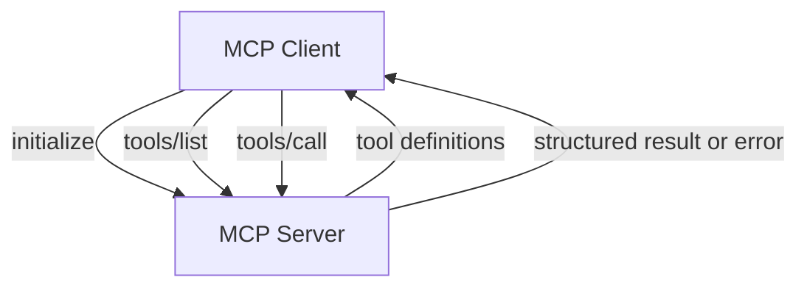

# MCP Tool Discovery

**Example ID:** `mcp-tool-discovery`

## What You Will Build

A minimal, measured **MCP protocol interaction**: a client initializes with a
server, discovers tool contracts through `tools/list`, and invokes a tool
through `tools/call` — all across a standardized protocol boundary.

```text
Client
    ↓
initialize
    ↓
MCP Server
    ↓
tools/list
    ↓
Tool Contract
    ↓
tools/call
    ↓
Structured Result
```

This example teaches the **MCP client/server protocol lifecycle**. It is not an
agent, not function-calling inside an application, and not a production MCP
deployment.

## What MCP is

The [Model Context Protocol (MCP)](https://modelcontextprotocol.io) standardizes
how clients discover and interact with **server-provided capabilities** through
a structured client/server contract.

MCP did not invent tool calling. It provides a **protocol boundary** so clients
can learn what a server exposes (`tools/list`) and invoke those capabilities
(`tools/call`) without importing the server's implementation directly.

## What this example demonstrates

1. **Initialization** — client and server negotiate protocol capabilities.
2. **Tool discovery** — client reads tool names, descriptions, and input schemas.
3. **Tool invocation** — client calls a discovered tool with structured arguments.
4. **Structured results** — server returns inspectable JSON outcomes.
5. **Invalid arguments** — the server rejects bad input at the tool boundary.

There is **no LLM**, no agent loop, and no hidden reasoning in traces.

## Architecture

```text
Client
    ↓
initialize
    ↓
MCP Server
    ↓
tools/list
    ↓
Tool Contract
    ↓
tools/call
    ↓
Structured Result
```



### Protocol lifecycle

```text
INITIALIZE → DISCOVER → INVOKE → RESULT
```

### Error case

```text
DISCOVER → INVOKE → INVALID ARGUMENTS → REJECTED
```

## MCP vs ordinary function calling

**Ordinary function calling** (in-process):

```text
Application code
    ↓
import / direct call
    ↓
Python function
```

The caller knows the function at compile/import time and invokes it directly.

**MCP:**

```text
MCP Client
    ↓
MCP protocol
    ↓
MCP Server
    ↓
Tool handler
```

The client discovers the contract at runtime through the protocol and invokes
through that interface. The server owns validation, execution, and results.

## MCP vs Agent Tool Calling

[`examples/agents/01-tool-calling`](../agents/01-tool-calling) teaches:

```text
Application / agent
    ↓
Tool executor (application-owned)
    ↓
Tool
```

This example teaches:

```text
MCP Client
    ↓
MCP protocol
    ↓
MCP Server
    ↓
Tool
```

The important addition is the **standardized protocol boundary** and
**capability discovery**. MCP does not universally replace in-process tool
executors; each fits different integration needs.

## Why this is not an agent

An agent repeatedly decides what to do next (model or policy loop). This example
uses **deterministic, explicit client actions**:

```text
initialize → tools/list → (optional) tools/call → result
```

There is no `think → choose → observe → choose` loop. Multi-tool discovery
shows that the client learned multiple capabilities, then **explicitly** selected
one — not autonomous reasoning.

## Transport

This Cookbook example uses the official MCP Python SDK (`mcp>=2.0.0`) with:

- **`Client` + in-process `InMemoryTransport`** (SDK default for server objects)
- **`mode=legacy`** — the SDK's legacy connection mode, which uses JSON-RPC
  framing and an explicit `initialize` handshake for this deterministic example

This keeps the example deterministic and local while still exercising the real
MCP client/server protocol. No network deployment, API keys, or external MCP
hosts are required.

`legacy` is an SDK connection mode chosen here for observability — it does not
define MCP, and production MCP deployments may use other SDK modes or transports
(stdio, Streamable HTTP, SSE).

## Server tools

| Tool | Arguments | Deterministic source |
|------|-----------|----------------------|
| `get_service_status` | `service` | `data/services.json` |
| `get_user_profile` | `user_id` | `data/users.json` |
| `search_documentation` | `query` | `data/docs.json` |

Tool definitions, input schemas, validation, and execution live on the **MCP
server**. The client discovers schemas through `tools/list` and constructs calls
according to the discovered contract.

## Measured cases

| Trace ID | Class | What it shows |
|----------|-------|---------------|
| `discovery` | `DISCOVERY` | initialize → tools/list → discovered contracts |
| `single-tool-service-status` | `SINGLE_TOOL_CALL` | discover → invoke one tool → structured result |
| `multi-tool-search-docs` | `MULTI_TOOL_DISCOVERY` | discover all tools → explicitly invoke one |
| `invalid-arguments-service-type` | `INVALID_ARGUMENTS` | discover → invoke with bad args → `tools/call` response with `isError: true` |

```bash
uv run python main.py --list-cases
uv run python main.py --case discovery --show-sequence
uv run python main.py --case single-tool-service-status --json
```

Export Lab traces:

```bash
uv run python export_lab_traces.py
```

## Provenance

This example is fully deterministic with no model:

```text
provenance:
  model:   not_used
  tools:   measured    # real MCP client/server protocol runs
  metrics: measured    # recorded from the run
```

Do not interpret local in-process latencies as production MCP performance.

## Metrics

Recorded operational metrics (when applicable):

| Metric | Meaning |
|--------|---------|
| `initializeMs` | Time for initialize handshake |
| `discoveryMs` | Time for tools/list |
| `toolCallMs` | Time for tools/call |
| `toolsDiscovered` | Count from tools/list |
| `toolCalls` | Invocation count |
| `successfulToolCalls` / `failedToolCalls` | Outcome counts |
| `totalMs` | End-to-end case duration |

This is **not a benchmark**. No quality or protocol scores are computed.

## Trace events

Observable protocol stages in `sequence`:

| Event kind | MCP method / meaning |
|------------|----------------------|
| `initialize_request` / `initialize_response` | `initialize` |
| `tools_list_request` / `tools_list_response` | `tools/list` |
| `tool_call_request` / `tool_call_response` | `tools/call` |
| `error` | protocol or transport failure outside a normal `tools/call` response |
| `termination` | session closed |

### Tool errors vs protocol errors

A **normal MCP tool error** (for example invalid arguments rejected by server
validation) is returned through the `tools/call` response with `isError: true`:

```text
tool_call_request → tool_call_response (isError: true)
```

Presentation metadata derives **REJECTED** from that failed
`tool_call_response`. This is not a separate protocol error event.

A **protocol or transport failure** (connection loss, handshake failure, or an
exception before a normal MCP response) may be recorded as an `error` event.
That is a different class of failure from a tool-level validation rejection.

Presentation metadata (`presentation.signatureView`) projects these for a future
Interactive Lab without adding new measurements.

## MCP vs RAG

**MCP** is a protocol for connecting clients to server-provided capabilities.

**RAG** is a retrieval architecture for grounding generation with external
information.

MCP can expose resources or tools that participate in retrieval workflows, but
this example does not implement RAG.

## Security

This local example does not implement authentication or authorization. In
production:

- The **server validates tool inputs** and owns execution.
- **Clients should not be trusted blindly** — treat tool arguments as untrusted.
- Use appropriate **authentication, authorization, and transport security**.

## No-CoT policy

Traces store **observable client actions and server responses** only. There is
no chain-of-thought, model deliberation, or hidden reasoning — and no LLM is
required for this example.

## Limitations

- In-process transport only (teaching fixture, not production topology).
- Three deterministic tools against local JSON fixtures.
- No streaming, OAuth, multi-server federation, or agent frameworks.
- Invalid-argument failures are returned as normal `tools/call` responses with
  `isError: true`; they are not represented as separate protocol error events.

## Project layout

```text
examples/mcp/01-tool-discovery/
├── README.md
├── pyproject.toml
├── config.py
├── main.py
├── export_lab_traces.py
├── lab_traces.json
├── server/
│   ├── app.py          # MCPServer tool registration
│   └── fixtures.py     # deterministic data access
├── client/
│   ├── cases.py        # four measured cases
│   ├── runner.py       # protocol runner + tracing
│   ├── schemas.py
│   └── trace.py        # Lab trace builder
├── data/
└── tests/
```

## Quick start

```bash
cd examples/mcp/01-tool-discovery
cp .env.example .env   # optional overrides
uv sync
uv run python main.py --case discovery --show-sequence
uv run pytest -q
```

Requires Python 3.12+ and [uv](https://docs.astral.sh/uv/).
