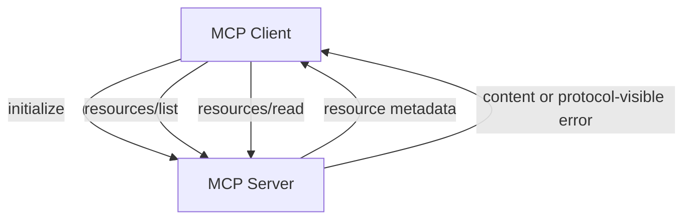

# MCP Resources

**Example ID:** `mcp-resources`

## What this example demonstrates

A measured **MCP resource protocol interaction**: a client initializes with a
server, discovers resources through `resources/list`, and reads content through
`resources/read` — across the official MCP client/server boundary.

```text
Client
    ↓
initialize
    ↓
MCP Server
    ↓
resources/list
    ↓
Resource metadata (URI / name / description / mimeType)
    ↓
resources/read
    ↓
Resource content
```

This example demonstrates the **resource side of MCP**. It is not an agent, not
tool calling, and not a production MCP deployment.

## 1. What MCP resources are

MCP **resources** are server-owned pieces of information identified by a stable
**URI**. A client discovers which resources exist, then selectively reads their
content.

Resources are for **information/content**. They are not an instruction to the
server to perform an application operation.

## 2. Resources vs tools

| Primitive | Client intent | Typical MCP methods |
|-----------|---------------|---------------------|
| **Tools** | Ask the server to perform an operation | `tools/list`, `tools/call` |
| **Resources** | Ask the server for information/content | `resources/list`, `resources/read` |

[`examples/mcp/01-tool-discovery`](../01-tool-discovery) demonstrates tools.

This example demonstrates resources only. The server does not expose MCP tools.

## 3. `resources/list`

After initialize, the client calls `resources/list`. The response is
authoritative for discovery: URIs, names, descriptions, and MIME types come from
the server.

Discovery ends after `resources/list`. It does not invent a read.

## 4. `resources/read`

Given a URI, the client calls `resources/read`. The response carries the
resource contents (URI, MIME type, and text where applicable) from the MCP
boundary.

## 5. URI-based resource identity

Resources are addressed by URI, for example:

| URI | Role |
|-----|------|
| `acme://docs/knowledge-platform` | Knowledge Platform documentation |
| `acme://docs/billing-portal` | Billing Portal documentation |
| `acme://status/services` | Acme AI service status JSON |

These are local, deterministic fixture URIs — not arbitrary external URLs.

## 6. Server-owned resource metadata

The **server owns**:

- resource URIs
- names and descriptions
- MIME types
- contents
- availability

The client discovers metadata; it does not maintain a duplicated frontend
catalog.

## 7. Client discovery

The client:

1. initializes
2. discovers resources through `resources/list`
3. selects a URI for a measured case
4. reads through `resources/read`

Measured cases may name a URI explicitly, but traces show discovery first.

## 8. Resource content

Contents are deterministic local fixtures under `data/`:

- markdown documentation for Knowledge Platform and Billing Portal
- JSON service status for the Acme AI environment

Successful reads record requested URI, returned URI, MIME type, and text from
the MCP response.

## 9. Invalid resource handling

The `invalid-resource-uri` case discovers resources, then requests
`acme://docs/does-not-exist`.

The failure is observed at the **MCP `resources/read` boundary** as a
protocol-visible error/response. The server does not fabricate content. The
trace records `resource_read_request` → `resource_read_response` (`isError: true`)
→ termination — without inventing a separate `error` event merely because the
read failed.

## 10. MCP protocol boundary

All discovery and reading cross the official MCP Python SDK client API:

```text
Client(server, mode="legacy")
  → initialize
  → list_resources()
  → read_resource(uri)
```

There is no direct Python bypass of resource handlers from the client runner.

## 11. Transport

This Cookbook example uses the official MCP Python SDK (`mcp>=2.0.0`) with:

- **`Client` + in-process `InMemoryTransport`**
- **`mode=legacy`** — JSON-RPC framing and an explicit `initialize` handshake

This keeps the example deterministic and local while exercising the real MCP
protocol. No network deployment, API keys, or external MCP hosts are required.

## 12. Provenance

No LLM is used:

```text
provenance:
  model:   not_used
  tools:   measured    # real MCP client/server protocol runs
  metrics: measured    # recorded from the run
```

## 13. Metrics

Operational/measured metrics only:

| Metric | Meaning |
|--------|---------|
| `initializeMs` | Initialize handshake |
| `discoveryMs` | `resources/list` |
| `resourceReadMs` | `resources/read` total |
| `resourcesDiscovered` | Count from `resources/list` |
| `resourcesRead` | Read attempts |
| `successfulReads` / `failedReads` | Outcome counts |
| `resourceBytes` | Bytes of successful text content |
| `modelTurns` | Always `0` |
| `toolCalls` | Always `0` |
| `totalMs` | End-to-end case duration |
| `terminationReason` | Session close / rejection reason |

This is **not a benchmark**. No resource quality, relevance, intelligence,
accuracy, or benchmark scores are computed.

## 14. No-CoT policy

Traces store **observable client actions and server responses** only. There is
no chain-of-thought, scratchpad, or hidden reasoning — and no LLM is required.

## 15. Security considerations

This local example does not implement authentication or authorization. In
production:

- The **server owns which URIs and contents are exposed**.
- Treat resource URIs and returned content according to your trust boundary.
- Use appropriate authentication, authorization, and transport security.

## 16. Limitations

- In-process transport only (local fixture, not production topology).
- Three deterministic resources against local fixtures.
- No tools, streaming subscriptions, OAuth, multi-server federation, or agent frameworks.
- Invalid URI failures are represented from the MCP `resources/read` response
  semantics; they are not separate transport `error` events.

## 17. Why this is not an agent

An agent repeatedly decides what to do next. This implementation uses
**deterministic, explicit client actions**:

```text
initialize → resources/list → (optional) resources/read → content or rejection
```

There is no model loop and no autonomous tool selection.

## 18. Why this is not a benchmark

Metrics are operational timings and counts from real protocol runs. They are not
scored capabilities. Do not interpret local in-process latencies as production
MCP performance.

## Architecture



### Signature flows

```text
DISCOVERY:        INITIALIZE → RESOURCES
SINGLE RESOURCE:  INITIALIZE → DISCOVER → READ → CONTENT
MULTI RESOURCE:   INITIALIZE → DISCOVER → READ → READ → CONTENT
INVALID RESOURCE: INITIALIZE → DISCOVER → READ → REJECTED
```

## Measured cases

| Trace ID | Class | What it shows |
|----------|-------|---------------|
| `discovery` | `DISCOVERY` | initialize → `resources/list` → discovered metadata |
| `single-resource-read-knowledge-platform` | `SINGLE_RESOURCE_READ` | discover → read one URI → content |
| `multi-resource-read-services` | `MULTI_RESOURCE_READ` | discover → sequential reads → content |
| `invalid-resource-uri` | `INVALID_RESOURCE` | discover → unknown URI → protocol-visible rejection |

## Project layout

```text
examples/mcp/02-resources/
├── README.md
├── pyproject.toml
├── config.py
├── main.py
├── export_lab_traces.py
├── lab_traces.json
├── server/
│   ├── app.py          # MCPServer resource registration
│   └── fixtures.py     # deterministic resource metadata + content
├── client/
│   ├── cases.py        # four measured cases
│   ├── runner.py       # protocol runner + tracing
│   ├── schemas.py
│   └── trace.py        # Lab trace builder
├── data/
└── tests/
```

## Quick start

```bash
cd examples/mcp/02-resources
uv sync

uv run python main.py --case discovery --show-sequence

uv run python main.py \
  --case single-resource-read-knowledge-platform \
  --show-sequence

uv run python main.py \
  --case multi-resource-read-services \
  --show-sequence

uv run python main.py \
  --case invalid-resource-uri \
  --show-sequence

uv run pytest -q

uv run python export_lab_traces.py
```

Requires Python 3.12+ and [uv](https://docs.astral.sh/uv/).
