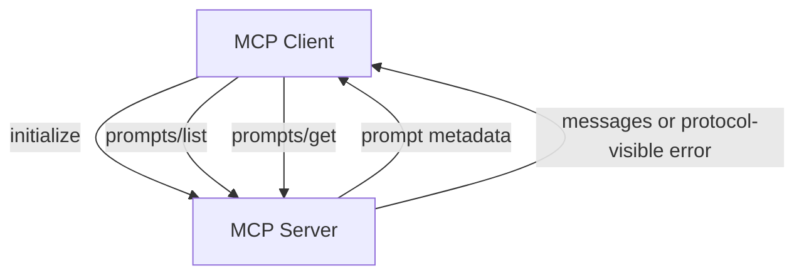

# MCP Prompts

**Example ID:** `mcp-prompts`

## What this example demonstrates

A measured **MCP prompt protocol interaction**: a client initializes with a
server, discovers reusable prompt templates through `prompts/list`, and retrieves
rendered messages through `prompts/get` — across the official MCP client/server
boundary.

```text
Client
    ↓
initialize
    ↓
MCP Server
    ↓
prompts/list
    ↓
Prompt metadata (name / description / arguments)
    ↓
prompts/get
    ↓
Rendered prompt messages
```

This example demonstrates the **prompt side of MCP**. It is not an agent, not
tool calling, not resource reading, and not a production MCP deployment.

## 1. What MCP prompts are

MCP **prompts** are server-owned reusable templates identified by a stable
**name**. A client discovers which prompts exist, then retrieves rendered
messages by supplying argument values.

Prompts are for **reusable message templates**. They are not an instruction to
the server to perform an application operation.

## 2. Prompts vs tools vs resources

| Primitive | Client intent | Typical MCP methods |
|-----------|---------------|---------------------|
| **Tools** | Ask the server to perform an operation | `tools/list`, `tools/call` |
| **Resources** | Ask the server for information/content | `resources/list`, `resources/read` |
| **Prompts** | Ask the server for reusable message templates | `prompts/list`, `prompts/get` |

[`examples/mcp/01-tool-discovery`](../01-tool-discovery) demonstrates tools.
[`examples/mcp/02-resources`](../02-resources) demonstrates resources.

This example demonstrates prompts only. The server does not expose MCP tools or
resources.

## 3. `prompts/list`

After initialize, the client calls `prompts/list`. The response is authoritative
for discovery: names, descriptions, and argument metadata come from the server.

Discovery ends after `prompts/list`. It does not call `prompts/get`.

## 4. `prompts/get`

Given a prompt name and arguments, the client calls `prompts/get`. The response
carries rendered `PromptMessage` objects from the MCP boundary.

## 5. Prompt catalog

The Acme AI server exposes three deterministic prompts:

| Name | Arguments | Role |
|------|-----------|------|
| `summarize-service` | `service_name` (required), `audience` (optional) | Concise service summary |
| `investigate-incident` | `service` (required), `incident` (required) | Multi-message incident workflow |
| `draft-status-update` | `service` (required), `status` (required) | Stakeholder status update |

## 6. Server-owned prompt metadata

The **server owns**:

- prompt names
- descriptions
- argument contracts
- rendered message content

The client discovers metadata; it does not maintain a duplicated frontend
catalog.

## 7. Client discovery

The client:

1. initializes
2. discovers prompts through `prompts/list`
3. selects a prompt for a measured case
4. retrieves messages through `prompts/get`

Measured cases name prompts explicitly, but traces show discovery first.

## 8. Prompt messages

Successful gets record the selected prompt, arguments supplied, and the actual
messages returned by the MCP server — including role, content type, and text.
Multi-message prompts preserve message order.

## 9. Invalid prompt handling

The `invalid-prompt-name` case discovers prompts, then requests
`does-not-exist`.

The failure is observed at the **MCP `prompts/get` boundary** as a
protocol-visible error/response. The server does not fabricate messages. The
trace records `prompt_get_request` → `prompt_get_response` (`isError: true`)
→ termination — without inventing a separate `error` event merely because the
get failed.

## 10. MCP protocol boundary

All discovery and retrieval cross the official MCP Python SDK client API:

```text
Client(server, mode="legacy")
  → initialize
  → list_prompts()
  → get_prompt(name, arguments)
```

There is no direct Python bypass of prompt handlers from the client runner.

## 11. Transport

This Cookbook example uses the official MCP Python SDK (`mcp>=2.0.0`) with:

- **`Client` + in-process `InMemoryTransport`**
- **`mode=legacy`** — JSON-RPC framing and an explicit `initialize` handshake

This keeps the example deterministic and local while exercising the real MCP
protocol. No network deployment, API keys, or external MCP hosts are required.

## 12. Provenance

No LLM is used:

```text
provenance:
  model:   not_used
  tools:   measured    # real MCP client/server protocol runs
  metrics: measured    # recorded from the run
```

## 13. Metrics

Operational/measured metrics only:

| Metric | Meaning |
|--------|---------|
| `initializeMs` | Initialize handshake |
| `discoveryMs` | `prompts/list` |
| `promptGetMs` | `prompts/get` total |
| `promptsDiscovered` | Count from `prompts/list` |
| `promptsRequested` | Get attempts |
| `successfulGets` / `failedGets` | Outcome counts |
| `messageCount` / `messageBytes` | Returned message totals |
| `modelTurns` | Always `0` |
| `toolCalls` | Always `0` |
| `resourcesRead` | Always `0` |
| `totalMs` | End-to-end case duration |
| `terminationReason` | Session close / rejection reason |

This is **not a benchmark**. No prompt quality, relevance, intelligence,
accuracy, or benchmark scores are computed.

## 14. No-CoT policy

Traces store **observable client actions and server responses** only. There is
no chain-of-thought, scratchpad, or hidden reasoning — and no LLM is required.

## 15. Security considerations

This local example does not implement authentication or authorization. In
production:

- The **server owns which prompts and argument contracts are exposed**.
- Treat returned prompt messages according to your trust boundary.
- Use appropriate authentication, authorization, and transport security.

## 16. Limitations

- In-process transport only (local fixture, not production topology).
- Three deterministic prompts in a small Acme AI catalog.
- No tools, resources, streaming subscriptions, OAuth, multi-server federation, or agent frameworks.
- Invalid prompt failures are represented from the MCP `prompts/get` response
  semantics; they are not separate transport `error` events.

## 17. Why this is not an agent

An agent repeatedly decides what to do next. This implementation uses
**deterministic, explicit client actions**:

```text
initialize → prompts/list → (optional) prompts/get → messages or rejection
```

There is no model loop and no autonomous tool selection.

## 18. Why this is not a benchmark

Metrics are operational timings and counts from real protocol runs. They are not
scored capabilities. Do not interpret local in-process latencies as production
MCP performance.

## Architecture



### Signature flows

```text
PROMPT DISCOVERY:   INITIALIZE → DISCOVER → PROMPTS
SINGLE PROMPT GET:  INITIALIZE → DISCOVER → PROMPTS → GET → MESSAGES
WITH ARGUMENTS:     INITIALIZE → DISCOVER → PROMPTS → GET → ARGUMENTS → MESSAGES
INVALID PROMPT:     INITIALIZE → DISCOVER → GET → REJECTED
```

## Measured cases

| Trace ID | Class | What it shows |
|----------|-------|---------------|
| `prompt-discovery` | `PROMPT_DISCOVERY` | initialize → `prompts/list` → discovered metadata |
| `single-prompt-get-summarize` | `SINGLE_PROMPT_GET` | discover → get one prompt → messages |
| `prompt-with-arguments-investigate` | `PROMPT_WITH_ARGUMENTS` | discover → get with multiple arguments → messages |
| `invalid-prompt-name` | `INVALID_PROMPT` | discover → unknown name → protocol-visible rejection |

## Project layout

```text
examples/mcp/03-prompts/
├── README.md
├── pyproject.toml
├── config.py
├── main.py
├── export_lab_traces.py
├── lab_traces.json
├── server/
│   ├── app.py          # MCPServer prompt registration
│   └── fixtures.py     # deterministic prompt catalog metadata
├── client/
│   ├── cases.py        # four measured cases
│   ├── runner.py       # protocol runner + tracing
│   ├── schemas.py
│   └── trace.py        # Lab trace builder
└── tests/
```

## Quick start

```bash
cd examples/mcp/03-prompts
uv sync

uv run python main.py --case prompt-discovery --show-sequence

uv run python main.py \
  --case single-prompt-get-summarize \
  --show-sequence

uv run python main.py \
  --case prompt-with-arguments-investigate \
  --show-sequence

uv run python main.py \
  --case invalid-prompt-name \
  --show-sequence

uv run pytest -q

uv run python export_lab_traces.py
```

Requires Python 3.12+ and [uv](https://docs.astral.sh/uv/).

## Trace generation

```bash
uv run python export_lab_traces.py
```

Writes `lab_traces.json` with four measured traces for a future Interactive Lab.

## Test command

```bash
uv run pytest -q
```

## Design boundaries

- **Prompts only** — no `tools/list`, `tools/call`, `resources/list`, or `resources/read`
- **No LLM** — returned prompt messages are the demonstrated artifact
- **Measured protocol** — traces reflect actual SDK client/server behavior
- **Deterministic** — stable catalog, arguments, and message content
