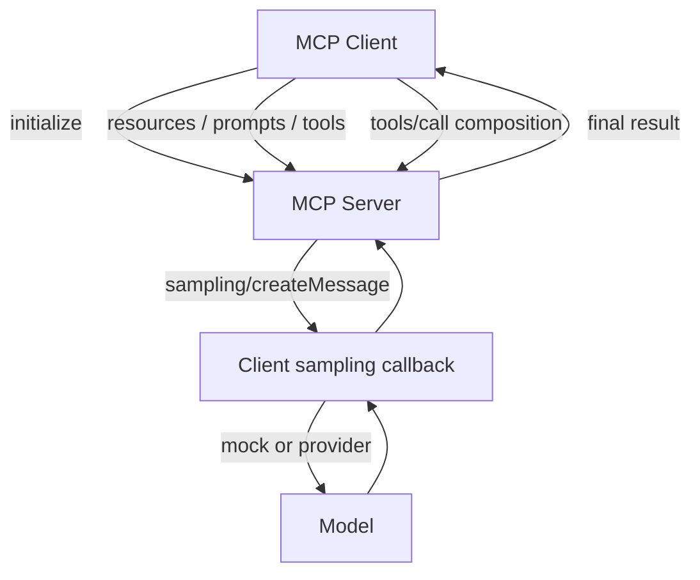

# MCP Composition

**Example ID:** `mcp-composition`

## What this example demonstrates

A measured **composed MCP workflow**: a client initializes with a server, uses
MCP resources, prompts, and tools where they participate, then a composition
tool causes the **MCP server to request model generation through Sampling**.
The client owns the sampling callback. The server does not call a model
provider API.

```text
Client
  │
  ├── discovers/uses MCP capabilities
  │
  ▼
MCP Server
  │
  ├── Resources → context/information
  ├── Prompts   → reusable interaction structure
  ├── Tools     → operations where appropriate
  │
  └── Sampling request (sampling/createMessage)
          │
          ▼
       MCP Client sampling callback
          │
          ▼
         mock or live model
          │
          ▼
       MCP Server
          │
          ▼
       final application result
```

This is a reference implementation of composition across MCP primitives. It is
not a standalone Sampling API demo, not an agent loop, and not a production
MCP deployment.

## 1. Progression

| Example | Primitive | Role |
|---------|-----------|------|
| MCP #1 | Tools | Perform operations (`tools/list`, `tools/call`) |
| MCP #2 | Resources | Expose information (`resources/list`, `resources/read`) |
| MCP #3 | Prompts | Reusable message templates (`prompts/list`, `prompts/get`) |
| **MCP #4** | **Composition + Sampling** | Those primitives participate in one workflow; the server requests generation through the client |

## 2. Client / server / model boundary

| Layer | Owns |
|-------|------|
| MCP server | Resources, prompts, tools, and the Sampling **request** |
| MCP client | Protocol session and the Sampling **callback** |
| Model provider | Actual generation, only when the client callback calls one |

The server uses `ctx.session.create_message(...)` from the MCP Python SDK
(`mcp>=2.0.0`, locked at 2.1.1). That sends `sampling/createMessage`. The
client answers with `sampling_callback=` passed to `Client(...)`.

Composition tools take the prior `resources/read`, `prompts/get`, and
`tools/call` results as arguments. The client runner binds those **observed
protocol results** into the next `tools/call`. Composition tools do not
reload server fixtures, and they do not re-render prompt templates.

If a required prior result is missing, the runner records a `compose_bind`
error and stops. It does not invent fixture content. Empty composition
payloads return `ok: false` from the tool without requesting Sampling.

A recorded protocol or application failure stops remaining steps.

Handshake-era Sampling needs a back-channel. This example pins
`mode="legacy"`, matching MCP #1–#3.

## 3. Sampling request/response shape

Traces record the SDK objects as dumped:

- request: `CreateMessageRequestParams` as dumped by the SDK (`messages`,
  `max_tokens`, optional `system_prompt`, …)
- response: `CreateMessageResult` (`role`, `content`, `model`, optional
  `stop_reason`) or `ErrorData` on rejection

Fields are not invented. `model` is present because the SDK result requires it.
Mock completions use `model=mock`. Live export records the provider model
returned by the API.

## 4. Measured cases

| Trace ID | Class | Workflow |
|----------|-------|----------|
| `resource-to-sampling` | `RESOURCE_TO_SAMPLING` | `resources/read` → compose tool → sampling grounded in that resource |
| `prompt-to-sampling` | `PROMPT_TO_SAMPLING` | `prompts/get` → compose tool → sampling from the same prompt template |
| `tool-resource-prompt-composition` | `TOOL_RESOURCE_PROMPT_COMPOSITION` | status tool → resource → prompt → compose tool (explicit `resource_uri` / `prompt_name`) → sampling |
| `sampling-failure` | `SAMPLING_FAILURE` | compose tool → sampling request → client `ErrorData` rejection |

The failure case is a controlled mock Sampling client that returns JSON-RPC
`ErrorData`. No model output is produced. Missing prior results, unknown
resource/prompt names, and empty composition payloads are covered by tests;
they are not additional Lab traces.

## 5. Transport

Official MCP Python SDK with:

- **`Client` + in-process `InMemoryTransport`**
- **`mode=legacy`** — JSON-RPC framing, initialize handshake, Sampling back-channel

No network deployment is required for the mock path.

## 6. Provenance

Mock path (CI and `lab_traces.json`):

```text
provenance:
  model:   mock          # or not_used when sampling is rejected
  tools:   measured
  metrics: measured
```

Live path (`lab_traces_llm.json`, optional):

```text
provenance:
  model:   <provider model from the sampling result>
  tools:   measured
  metrics: measured
```

Token counts and quality scores are not fabricated.

## 7. No-CoT policy

Traces store **observable protocol events and returned content** only. There is
no chain-of-thought, scratchpad, or hidden reasoning field.

## 8. Metrics

Operational/measured metrics only: initialize, discovery, resource/prompt/tool
latencies, sampling latency, counts, and termination reason. This is **not a
benchmark**.

## Architecture



### Signature flows

```text
RESOURCE_TO_SAMPLING:              INITIALIZE → RESOURCE → CONTEXT → SAMPLING → RESULT
PROMPT_TO_SAMPLING:                INITIALIZE → PROMPT → ARGUMENTS → SAMPLING → RESULT
TOOL_RESOURCE_PROMPT_COMPOSITION:  INITIALIZE → TOOL → RESOURCE → PROMPT → SAMPLING → RESULT
SAMPLING_FAILURE:                  INITIALIZE → RESOURCE → SAMPLING → REJECTED
```

## Project layout

```text
examples/mcp/04-composition/
├── README.md
├── pyproject.toml
├── config.py
├── main.py
├── export_lab_traces.py
├── lab_traces.json
├── data/
├── server/
│   ├── app.py
│   ├── fixtures.py
│   └── prompts.py
├── client/
│   ├── cases.py
│   ├── runner.py
│   ├── sampling.py
│   ├── schemas.py
│   └── trace.py
└── tests/
```

## Quick start

```bash
cd examples/mcp/04-composition
uv sync --extra dev

uv run python main.py --case resource-to-sampling --show-sequence
uv run python main.py --case prompt-to-sampling --show-sequence
uv run python main.py --case tool-resource-prompt-composition --show-sequence
uv run python main.py --case sampling-failure --show-sequence

uv run pytest -q
uv run python export_lab_traces.py --force
```

Optional live export (requires an API key; never used by CI):

```bash
uv sync --extra dev --extra llm
uv run python export_lab_traces.py --mode live --force
```

Writes `lab_traces_llm.json` without overwriting `lab_traces.json`.

Requires Python 3.12+ and [uv](https://docs.astral.sh/uv/).

## Limitations

- In-process transport only (local fixture, not production topology).
- Deterministic Acme AI catalog: three resources, two prompts, four tools.
- No OAuth, multi-server federation, or agent loop.
- The MCP Python SDK currently emits a deprecation warning for Sampling
  (`SEP-2577`, 2026-07-28). This example still uses Sampling because that is
  the protocol mechanism for server-requested generation through the client.

## Design boundaries

- **Composition, not a Sampling-only demo** — Sampling exists to complete the workflow
- **Server does not import OpenAI** — the client sampling callback owns model I/O
- **Measured protocol** — traces come from actual SDK client/server runs
- **Deterministic mock path** — CI has no API key dependency
- **Prior-result dataflow** — composition arguments come from earlier MCP
  responses in the same run, not from independently reloaded fixtures
