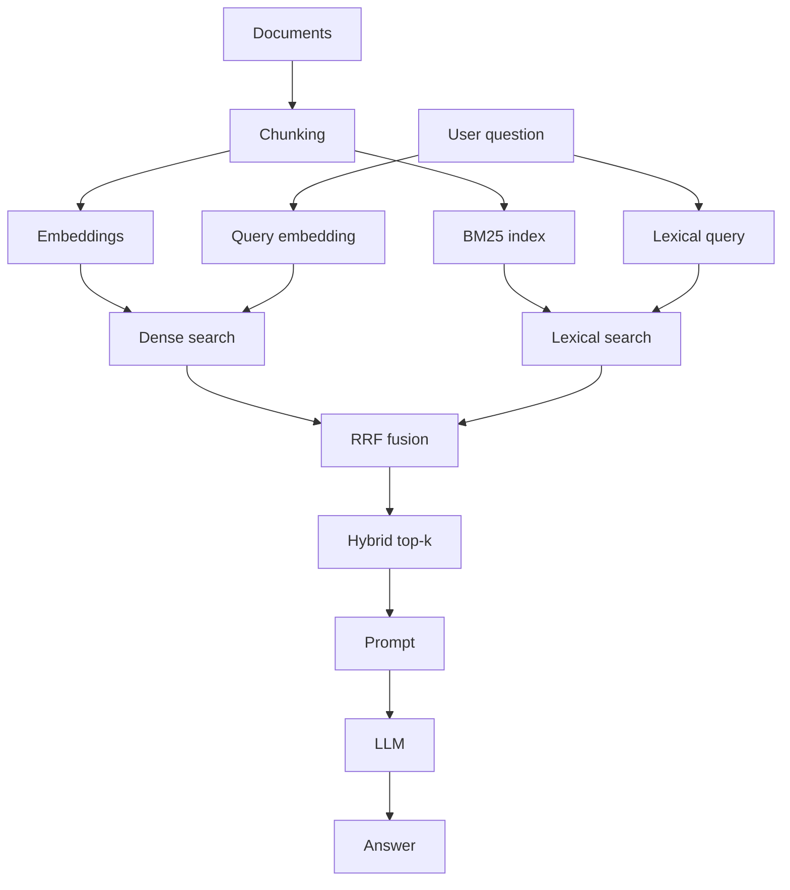

# Hybrid RAG

**Example ID:** `hybrid-rag`

## What it demonstrates

Hybrid retrieval combines **dense** (embedding / cosine) search with **lexical** (BM25) search, then fuses the two ranked lists with **Reciprocal Rank Fusion (RRF)**.

The point is not “hybrid always wins.” The point is that the two signals are complementary — and you can inspect that difference.

## Why Basic RAG can fail

Dense retrieval is excellent at semantic paraphrase:

> “flaky connectivity” ≈ “intermittent / unreliable network”

It can struggle with exact identifiers that rarely appear in training-like paraphrase space:

- error codes (`E_CONN_42`)
- versions (`v2.3`)
- API/method names (`getUserProfileAsync`)
- SKUs (`NX-4400-PRO`)

Lexical search has the opposite strengths: strong on rare exact tokens, weaker on paraphrase.

Hybrid RAG keeps both signals.

In **this** small corpus, modern embeddings often still retrieve clear identifiers
(e.g. `E_CONN_42` at dense #1). That does not refute hybrid retrieval: BM25 still
shows sharper precision (often a single high-confidence hit), and the candidate
*sets* differ — RRF’s job is combining those rankings, not proving hybrid always wins top-1.

## Architecture



```text
Documents
   ↓
Chunking
   ↓
 ┌───────────────────────┐
 ↓                       ↓
Embeddings             BM25 index
 │                       │
Query → Embedding        Query
 ↓                       ↓
Dense Search        Lexical Search
       \             /
             RRF
              ↓
        Hybrid Top-K
              ↓
            Prompt → LLM → Answer
```

## Dense vs Lexical vs Hybrid

| Mode | Signal | Strong at | Weak at |
|------|--------|-----------|---------|
| Dense | Cosine over embeddings | Paraphrase / intent | Rare exact IDs |
| Lexical | BM25 term statistics | Exact codes, names, versions | Paraphrase |
| Hybrid | RRF over both ranks | Broader candidate coverage | Still not a reranker |

## Reciprocal Rank Fusion

```text
RRF(d) = Σ 1 / (k + rank(d))
```

Default `k = 60` (conventional). RRF combines **ranks**, not raw scores, so you do not need to normalize cosine and BM25 onto one scale.

This example stops at RRF on purpose. Fused order can still be imperfect — that limitation motivates a later **reranking** example.

## Run

Requires Python 3.12+ and [uv](https://docs.astral.sh/uv/).

```bash
cd examples/rag/02-hybrid-rag
cp .env.example .env
# set OPENAI_API_KEY in .env

uv sync
uv run python main.py "How do I fix error E_CONN_42?"
```

## Compare retrieval modes

Side-by-side dense / lexical / hybrid (then generate with hybrid context):

```bash
uv run python main.py --compare "What should I do when a customer's internet keeps cutting out unexpectedly?"
uv run python main.py --compare "How do I fix error E_CONN_42?"
uv run python main.py --compare "How do I load user profiles with NebulaAPI v2.3 without blocking?"
```

Generate from one mode only:

```bash
uv run python main.py --mode dense "What should I do when a customer's internet keeps cutting out unexpectedly?"
uv run python main.py --mode lexical "How do I fix error E_CONN_42?"
uv run python main.py --mode hybrid "How do I load user profiles with NebulaAPI v2.3 without blocking?"
```

## Example output

Real rankings from this corpus (abridged):

**Paraphrase query** — dense returns a broader neighborhood; lexical is sparse:

```text
DENSE (cosine)
  #1  sample-1   score=0.57  Restoring service when the network keeps dropping …
  #2  sample-3   score=0.34  Softening slow backend profile reads …
  #3  sample-2   score=0.28  Error code E_CONN_42 …

LEXICAL (BM25)
  #1  sample-1   score=2.59  Restoring service when the network keeps dropping …

HYBRID (RRF)
  #1  sample-1   dense_rank=1  lexical_rank=1
  #2  sample-3   dense_rank=2  lexical_rank=None   ← kept via dense only
  #3  sample-2   dense_rank=3  lexical_rank=None
```

**Identifier query** — both hit `E_CONN_42`; lexical is extremely precise:

```text
DENSE (cosine)
  #1  sample-2   Error code E_CONN_42 …
  #2  sample-1   Restoring service …
  #3  sample-3   Softening slow backend profile reads …

LEXICAL (BM25)
  #1  sample-2   Error code E_CONN_42 …   ← only positive hit

HYBRID (RRF)
  #1  sample-2   dense_rank=1  lexical_rank=1
  #2  sample-1   dense_rank=2  lexical_rank=None
  #3  sample-3   dense_rank=3  lexical_rank=None
```

Run `--compare` yourself for full measured scores.

## Configuration

| Variable | Default | Purpose |
|----------|---------|---------|
| `OPENAI_API_KEY` | _(required)_ | API key |
| `OPENAI_BASE_URL` | OpenAI default | OpenAI-compatible endpoint |
| `EMBEDDING_MODEL` | `text-embedding-3-small` | Same family as basic-rag |
| `CHAT_MODEL` | `gpt-4o-mini` | Grounded generation |
| `CHUNK_SIZE` | `520` | Characters per chunk |
| `CHUNK_OVERLAP` | `40` | Overlap between chunks |
| `DENSE_TOP_K` | `3` | Dense candidates |
| `LEXICAL_TOP_K` | `3` | BM25 candidates |
| `HYBRID_TOP_K` | `3` | Fused results kept |
| `RRF_K` | `60` | RRF constant |

## Key Code

| Stage | File | Focus |
|-------|------|--------|
| Orchestration / compare CLI | `main.py` | `build_indexes`, `print_compare` |
| Dense store | `rag/store.py` | `InMemoryVectorStore.search` |
| Lexical BM25 | `rag/bm25.py` | `BM25Index`, `tokenize` |
| Fusion | `rag/fusion.py` | `reciprocal_rank_fusion` |
| Retrieval views | `rag/retriever.py` | `retrieve_all` |
| Generation | `rag/generator.py` | `build_prompt`, `generate_answer` |
| Lab traces | `export_lab_traces.py` | measured hybrid traces |

## Engineering decisions

- **Markdown section chunks** — one `##` topic per chunk so error codes and prose stay separable for inspection.
- **Same embedding/chat stack as basic-rag** — isolate the new idea (hybrid fusion), not a new vendor.
- **Hand-rolled Okapi BM25** — small, readable, no search framework; tokenizer keeps `E_CONN_42` / `v2.3` intact.
- **RRF instead of score mixing** — avoids fake cosine↔BM25 normalization.
- **`--compare` is first-class** — the teaching moment is inspecting three rankings.
- **No reranker** — leaves a clear next lesson: better candidates ≠ perfect order.
- **Corpus designed for complementarity** — paraphrased connectivity questions vs exact error/API identifiers; parameters are not tuned after the fact to force hybrid “wins.”

## Limitations

This example does **not** include:

- reranking
- query rewriting
- metadata filtering
- production vector databases / Elasticsearch
- distributed search
- retrieval evaluation harnesses
- agents / tool calling
- conversational memory

## Next concepts

- **Reranking** — hybrid improves recall/coverage; a cross-encoder can still reorder the fused list.
- **Retrieval evaluation** — measure when dense, lexical, or hybrid actually helps.

## Related DataAIHub Resources

| Resource | Link |
|----------|------|
| Guide | _coming soon_ |
| Architecture | _coming soon_ |
| Interactive Lab | _not yet_ (`hybrid-rag`) |

## Tests

```bash
uv sync --extra dev
uv run pytest
uv run ruff check .
uv run ruff format --check .
```

## Lab traces

```bash
uv run python export_lab_traces.py
```

Writes measured traces to `lab_traces.json` (`metricsProvenance: measured`).
