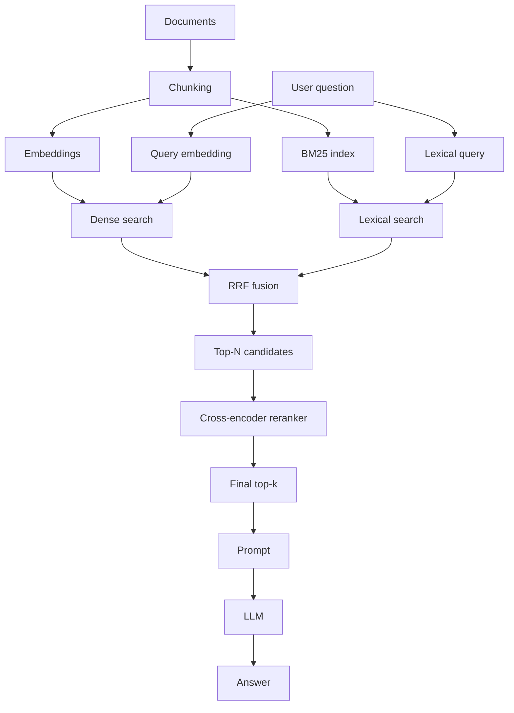

# Reranking

**Example ID:** `reranking`

## What this demonstrates

Hybrid retrieval finds a **candidate set**. A **cross-encoder reranker** then
scores each `(query, candidate)` pair and produces a query-aware final ordering
for the generation context.

The teaching point:

> We already have good retrieval candidates. Why do we need reranking?

Because candidate *discovery* and candidate *refinement* are different jobs.

## Where it fits in the RAG pipeline

```text
Dense Retrieval
       \
        \
         → RRF → broader candidate set
        /
BM25
       ↓
   Reranker
       ↓
 Final Top-K
       ↓
    Prompt
       ↓
      LLM
       ↓
    Answer
```

This example **extends** [`02-hybrid-rag`](../02-hybrid-rag). It does not replace
hybrid retrieval with reranking.

## The problem

Retrieval systems optimize for searching a corpus quickly and covering useful
candidates (recall). The top of that ranking is not necessarily the best final
relevance order for a specific query.

Hybrid RRF improves coverage by combining dense and lexical signals. It still
does not jointly score “how well does *this query* match *this passage*?”

## Retrieval vs Reranking

| | Retrieval | Reranking |
|---|---|---|
| Scope | Large corpus | Small candidate set |
| Goal | Find plausible candidates | Decide final relevance order |
| Typical signal | Bi-encoder vectors / BM25 / RRF | Cross-encoder over `(query, doc)` |
| Optimized for | Recall + speed | Precision of top-k |
| Cost | Cheap per document | More expensive per pair |

## Architecture



```text
Documents
   ↓
Chunking
   ↓
Dense + BM25 indexes

Query
   ↓
Dense + BM25 retrieval
   ↓
RRF
   ↓
Top-N candidates   (candidate_k = 8)
   ↓
Cross-Encoder Reranker
   ↓
Final Top-K        (final_context_k = 3)
   ↓
Prompt → LLM → Answer
```

## How the cross encoder works

**Bi-encoder style retrieval** (dense):

```text
query → vector
document → vector
compare vectors (e.g. cosine)
```

Query and document are encoded independently. Fast over large corpora; weaker at
fine-grained query–passage interaction.

**Cross encoder**:

```text
(query + document)
        ↓
      model
        ↓
 relevance score
```

The model sees the query and candidate together. That is more expressive — and
too expensive to run over the whole corpus, which is why we only rerank the
hybrid candidate pool.

## Run

Requires Python 3.12+ and [uv](https://docs.astral.sh/uv/).

```bash
cd examples/rag/03-reranking
cp .env.example .env
# set OPENAI_API_KEY in .env

uv sync
uv run python main.py "How do I fix error E_CONN_42 on the EdgeGateway?"
```

### First-run model download

The local reranker (`cross-encoder/ms-marco-MiniLM-L6-v2`) downloads on first
use (~90 MB). Hugging Face / sentence-transformers cache it; later runs reuse
the cache. No custom cache is implemented here.

Reranking itself needs **no paid API key**. Embedding and generation follow the
same OpenAI-compatible provider conventions as Hybrid RAG.

## Example output

Default runs print hybrid candidates, then the reranked final context. Measured
example (`Is calendar certificate rotation the fix for E_CONN_42?`):

```text
HYBRID CANDIDATES (RRF)
  #1  sample-6   Gateway TLS certificate rotation schedule
  #2  sample-2   Error code E_CONN_42
  #3  sample-7   EdgeGateway timeout configuration
  ...

RERANKED
  #1  sample-2   ↑ 2 → 1   reranker=6.2051  …
  #2  sample-6   ↓ 1 → 2   reranker=5.8996  …
  #3  sample-7   —         reranker=0.4302  …
```

Movement labels:

- `↑ 2 → 1` — promoted
- `↓ 1 → 2` — demoted
- `—` — unchanged rank

Teaching queries used for measured traces:

```bash
uv run python main.py --compare \
  "Is calendar certificate rotation the fix for E_CONN_42?"
uv run python main.py --compare \
  "Intermittent TLS handshake failures without a stable error code — checklist?"
uv run python main.py --compare \
  "Should I keep using getUserProfile or switch for concurrent UIs?"
```

Generate from an earlier stage only (teaching / ablation):

```bash
uv run python main.py --mode hybrid "..."
uv run python main.py --mode dense "..."
```

## Configuration

| Setting | Env var | Default | Role |
|---------|---------|---------|------|
| `candidate_k` | `CANDIDATE_K` | `8` | Hybrid/RRF pool size before rerank |
| `final_context_k` | `FINAL_CONTEXT_K` | `3` | Chunks sent to the prompt after rerank |
| `dense_top_k` | `DENSE_TOP_K` | `8` | Dense retrieval breadth |
| `lexical_top_k` | `LEXICAL_TOP_K` | `8` | BM25 retrieval breadth |
| `rrf_k` | `RRF_K` | `60` | Conventional RRF constant |
| `reranker_model` | `RERANKER_MODEL` | `cross-encoder/ms-marco-MiniLM-L6-v2` | Local cross-encoder |
| `embedding_model` | `EMBEDDING_MODEL` | `text-embedding-3-small` | Dense embeddings |
| `chat_model` | `CHAT_MODEL` | `gpt-4o-mini` | Generation |

The important teaching knobs are **`candidate_k` vs `final_context_k`**:
retrieve broadly, then refine narrowly.

## Engineering decisions

- **Hybrid retrieval retained** — reranking starts from RRF candidates, not the
  full corpus and not dense-only results.
- **Cross-encoder selected** — makes the bi-encoder vs joint scoring contrast
  inspectable in a few lines of Python.
- **Local reranking** — no Cohere/Voyage/Jina paid rerank API; no LLM-as-reranker.
- **Broader candidates, narrow final context** — default `8 → 3` so movement is
  visible without flooding the prompt.
- **Provenance preserved** — each reranked hit still carries dense/BM25/RRF ranks
  and scores alongside the reranker score.

### Model selection

Evaluated small public MS MARCO cross-encoders:

| Model | Approx. size | Notes |
|-------|--------------|-------|
| `ms-marco-MiniLM-L2-v2` | smaller / faster | Lower quality |
| `ms-marco-MiniLM-L4-v2` | mid | Good CPU speed |
| **`ms-marco-MiniLM-L6-v2`** | ~23M params / ~90 MB | Best small quality/speed default |
| `ms-marco-MiniLM-L12-v2` | larger | Diminishing returns for this corpus |

Selected **`cross-encoder/ms-marco-MiniLM-L6-v2`**: Apache-2.0, English passage
reranking, CPU-friendly, sentence-transformers `CrossEncoder.predict(pairs)` API,
widely documented. Dependency added: `sentence-transformers` (pulls PyTorch).

Scores shown in the CLI are the model's relevance **logits** (higher = more
relevant). They are not calibrated 0–1 probabilities — only relative order
matters for final context selection.

## Tradeoffs

- Reranking adds latency proportional to candidate count.
- First run downloads model weights; later runs are faster.
- Reranking tens of candidates is practical; reranking an entire corpus is not.
- Query-aware ordering ↔ extra compute.

Measured stage timings are recorded in `lab_traces.json` (not a benchmark).

## Limitations

This example does **not** include:

- LLM-as-reranker
- Hosted / paid reranking APIs
- Listwise reranking
- Query rewriting
- Metadata filtering
- Retrieval evaluation frameworks
- Production search infrastructure
- Interactive Lab UI (traces are prepared for a future Lab)

## Next concepts

Retrieval quality should eventually be **measured**, not only inspected. Later
steps in a learning path typically introduce evaluation (precision/recall/nDCG
style checks) before more advanced retrieval tricks.

## Related Labs

Conceptual counterpart: DataAIHub **Reranking** Lab (future). Measured traces in
`lab_traces.json` are designed so a Lab can render before/after rankings with
movement, RRF score, and reranker score.

Export / refresh measured traces:

```bash
uv run python export_lab_traces.py
```

## Tests

```bash
uv run pytest -q
```

Tests cover pair construction, score→order logic, provenance, rank movement,
final top-k selection, and the critical boundary that **prompt context follows
reranked order** — not original RRF order. They do not download the reranker or
call paid APIs.

## Measured trace review

| Query | Hybrid top-3 | Reranked top-3 | Important movement | Demonstrates | Class |
|-------|--------------|----------------|--------------------|--------------|-------|
| Calendar rotation fix for `E_CONN_42`? | cert schedule, E_CONN_42, timeouts | E_CONN_42, cert schedule, timeouts | `sample-2` ↑ 2→1 | Reranker prefers remediation over lexical distractor | CLEAR |
| Intermittent TLS checklist (no stable code) | checklist, E_CONN_42, connectivity | same order | none in top-3 | Good hybrid ranking can already be final | CLEAR |
| Keep `getUserProfile` or switch for concurrent UIs? | legacy sync, caching, slow-reads | async v2.3, legacy sync, caching | `sample-4` ↑ 4→1 | Best answer was outside hybrid top-3; scores still weak/negative | PARTIAL |

Classifications reflect measured behavior. No scores or rankings were edited to
force a teaching story.
