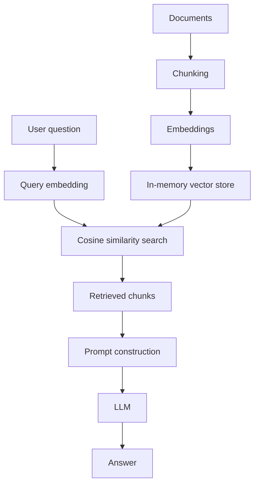

# Basic RAG

**Example ID:** `basic-rag`

## What You Will Build

A minimal retrieval-augmented generation pipeline: load a small document, chunk it, embed the chunks, retrieve the nearest chunks for a question, and generate an answer grounded in that context.

## Architecture



```text
Documents → Chunking → Embeddings → Vector storage

User Question → Query embedding → Similarity search
             → Retrieved chunks → Prompt → LLM → Answer
```

## How It Works

1. **Load** — read `data/sample.md`.
2. **Chunk** — split into overlapping character windows (`chunk_size` / `chunk_overlap`).
3. **Embed** — call an embedding model for every chunk.
4. **Store** — keep vectors in an in-memory store (numpy cosine similarity).
5. **Retrieve** — embed the question, return top-k nearest chunks.
6. **Generate** — insert chunks into a grounded prompt and call the chat model.

Each stage lives in its own module under `rag/` so you can follow the pipeline in code.

## Run It

Requires Python 3.12+ and [uv](https://docs.astral.sh/uv/).

```bash
cd rag/01-basic-rag
cp .env.example .env
# set OPENAI_API_KEY in .env

uv sync
uv run python main.py "What is retrieval-augmented generation?"
```

Show retrieved chunks:

```bash
uv run python main.py --show-chunks "Why do we overlap chunks?"
```

## Configuration

| Variable | Default | Purpose |
|----------|---------|---------|
| `OPENAI_API_KEY` | _(required)_ | API key |
| `OPENAI_BASE_URL` | OpenAI default | OpenAI-compatible endpoint |
| `EMBEDDING_MODEL` | `text-embedding-3-small` | Embedding model |
| `CHAT_MODEL` | `gpt-4o-mini` | Chat / completion model |
| `CHUNK_SIZE` | `400` | Characters per chunk |
| `CHUNK_OVERLAP` | `80` | Overlap between chunks |
| `TOP_K` | `3` | Chunks retrieved per query |

Any OpenAI-compatible API works via `OPENAI_BASE_URL`.

## Key Code

| Stage | File | Focus |
|-------|------|--------|
| Orchestration | `main.py` | `build_index`, `main` |
| Chunking | `rag/chunker.py` | `chunk_text` |
| Embeddings | `rag/embeddings.py` | `embed_texts` |
| Vector store | `rag/store.py` | `InMemoryVectorStore.search` |
| Retrieval | `rag/retriever.py` | `retrieve` |
| Generation | `rag/generator.py` | `build_prompt`, `generate_answer` |

## Engineering Decisions

- **Character chunking** — avoids tokenizer dependencies so the stage stays obvious. Token-aware splitting is a natural next step.
- **Chunk size 400 / overlap 80** — small enough for the tiny sample doc to produce multiple chunks; overlap reduces boundary cutoffs.
- **In-memory cosine store** — teaches dense retrieval without standing up a vector database.
- **top_k = 3** — enough context for this corpus without flooding the prompt.
- **Grounded system prompt** — asks the model to admit missing information instead of inventing it.
- **Direct OpenAI SDK** — concept over framework; no LangChain/LlamaIndex required to understand RAG.

## Tradeoffs

This example does **not**:

- persist the index across runs
- use hybrid (keyword + dense) retrieval
- rerank candidates
- evaluate answer quality
- handle multi-document corpora at scale
- stream responses or expose an HTTP API

## Production Considerations

For production you would typically add durable vector storage, better chunking, hybrid retrieval and/or reranking, evaluation harnesses, observability, rate limiting, and safer prompt/context handling. See later cookbook examples once they exist (`hybrid-rag`, `reranking`, `production-rag`).

## Related DataAIHub Resources

| Resource | Link |
|----------|------|
| Guide | _coming soon_ |
| Architecture | _coming soon_ |
| Interactive Lab | _coming soon_ (`basic-rag`) |

## Tests

Smoke tests cover chunking and similarity search without paid API calls:

```bash
uv sync --extra dev
uv run pytest
uv run ruff check .
uv run ruff format --check .
```
